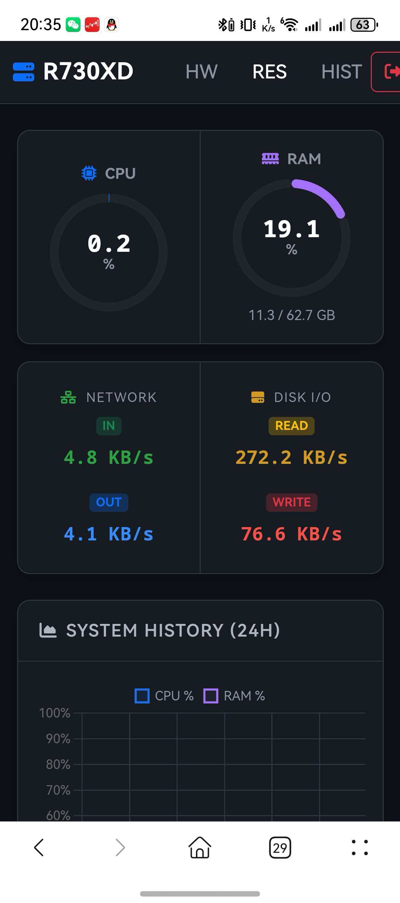
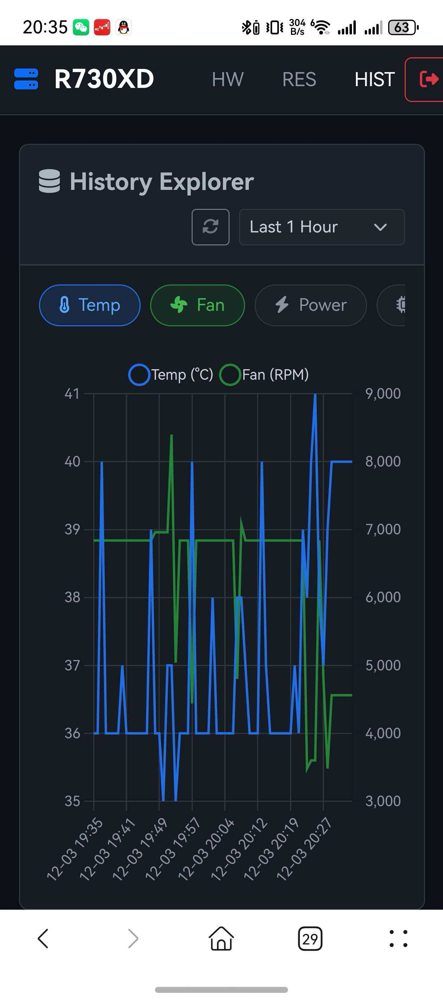
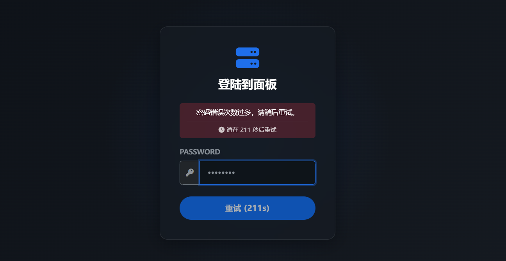

# IPMI 硬件监控与风扇控制面板

这是一个轻量级的、基于 Web 的仪表板，用于通过 IPMI 监控服务器硬件状态并控制风扇速度。它使用 Python Flask 作为后端，并调用 `ipmitool` 和 `sensors` 等系统命令来收集数据。

本仪表板已在本人的**DELL PowerEdge R730xd**上部署并正常使用，其他型号服务器/PC也可部署。


<p align="center">
  
  
  
  
  
</p>

## 主要功能

- **硬件状态监控**: 实时显示 CPU 温度、功耗、风扇转速 (RPM) 以及所有可用的 IPMI 传感器数据。
- **系统资源监控**: 实时图表展示 CPU 使用率、内存使用情况、网络吞吐量和磁盘 I/O。
- **GPU 深度监控**:
    *   **分布式采集**: 通过轻量级 Agent 支持监控直通给虚拟机的显卡（支持多显卡并列展示）。
    *   **实时性能指标**: 实时显示 GPU 负载、显存占用、实时功耗、核心/显存频率、风扇转速以及 ECC 错误计数。
    *   **状态可视化**: 集成实时波形图展示 GPU 核心负载与显存趋势，并根据温度区间（<50°C 绿色, 50-70°C 黄色, >70°C 红色）动态着色提醒。
- **智能风扇控制**:
    - **自动模式**: 将风扇控制权交还给主板 IPMI 控制器。
    - **手动曲线模式**: 用户可以自定义温度-风扇转速百分比响应曲线。
    - **固定转速模式**: 支持一键锁定风扇至指定转速，不受温度波动影响，适用于特定负载场景。
- **风扇校准**: 内置校准程序，可自动测试并生成 PWM 占空比到实际风扇 RPM 的映射关系，从而实现更精确的转速控制。
- **历史数据图表**: 
    *   **多维对比**: 支持查看 1H, 6H, 24H, 3D, 7D 等不同时间跨度的性能指标。
    *   **准星同步**: 多个图表间的光标准星同步，方便跨维度（如温度、功耗、负载）进行关联分析。
    *   **智能降采样**: 采用数据降采样算法，确保在分析长达 7 天的历史曲线时依然保持极高的响应速度。
    *   **电力消耗统计**: 支持区间耗电与累计耗电量（kWh）的实时精确统计，数据每小时自动降采样永久保存，支持自定义统计起始日期。
    *   **数据容错修复**: 自动识别并修复 IPMI 采集过程中的 0 值异常点，确保历史曲线与功耗统计的准确性。
    *   **一键数据导出**: 支持将全量历史监控数据与电力持久化记录导出为标准 CSV 格式（ZIP 打包下载），方便离线分析。
    *   **Insights 深度聚合分析**: 
        - **100% 全量聚合**: 分析引擎直接基于秒级原始数据点进行统计，确保分析结果绝对精准。
        - **异构计算能效分析**: 提供 CPU 与 GPU 的平均功耗配比。
        - **负载与温度强度分布**: 高精度统计设备在不同负载区间及温度段的时间占比。
        - **显存效率分析**: 采用后端 2D 聚类算法预处理，以气泡图形式展示 GPU 利用率与显存占用的关联分布。
        - **极速性能**: 通过后端数据预处理，支持长达 7 天的大跨度历史分析且交互丝滑流畅。
- **全端适配**: 专门针对移动端浏览器优化，支持触控操作、横向滑动标签页及响应式布局，随时随地掌握服务器状态。
- **安全与性能**:
    - **高强度防爆破**: 系统集成渐进式防御机制。失败 3 次起触发强制响应延迟，惩罚时长随失败次数稳步递增（最高达 300s）。
    - **人性化宽恕机制**: 合法用户即便在遭受爆破导致 IP/指纹被限制期间，只要输入正确密码，仅需 3s 固定延迟即可快速进入系统，并自动清除错误计数。
    - **智能指纹识别**: 针对内网穿透（如 frp）等复杂网络环境，系统自动识别并结合 `IP + User-Agent` 进行细粒度指纹校验。确保爆破者被精准隔离，不影响正常用户的访问体验。
    - **可视化审计日志**: 点击导航栏左侧服务器名称可进入专用的"审计日志"页面。
        - **实时监控**: 自动刷新展示最新的登录尝试记录。
        - **智能指纹归类**: 点击任意 IP 或设备标签（Tag），高亮显示所有相同指纹的记录，快速关联同一来源的所有行为。
        - **安全信息展示**: 登录失败时显示连续失败次数与当前罚时（秒），帮助管理员判断是否为恶意爆破。
        - **详细历史展开**: 点击 `[详情]` 可查看完整的 User-Agent 与系统原始日志信息。
        - **24H 采集延迟监控**: 顶部集成实时延迟图表，直观展示过去 24 小时的 IPMI 数据采集性能（绿色<1.5s，黄色<5s，红色>5s）。
    - **实时安全提醒**: 所有页面集成"新日志红点提醒"机制，确保管理员第一时间掌握潜在的安全风险。
    - **深度安全防护**: 采用 PRG (Post-Redirect-Get) 模式杜绝刷新页面导致的重复提交；支持识别 `X-Forwarded-For` 真实 IP；后端执行固定时长延迟以抹平处理耗时（Timing Attack 防护）；针对日志审计集成 **XSS 过滤**确保 UA 安全；启用 **CSRF 跨站防护**（SameSite Cookie 策略）保护管理 API。
    - **读写优化**: 数据库采用 WAL (Write-Ahead Logging) 模式，确保在大规模历史数据存储与实时访问时的极致流畅。
    - **自动 HTTPS**: 系统自动检测 `cert/` 目录。若存在 `server.crt` 和 `server.key`，将自动启用安全加密连接。

<p align="center">
  
  
</p>

## 技术栈

- **后端**: Flask
- **数据采集**: `ipmitool`, `lm-sensors` , `psutil`
- **数据库**: SQLite
- **前端**: HTML, JavaScript 

## 如何运行

1.  **安装依赖**:
    ```bash
    # 确保系统已安装 ipmitool 和 lm-sensors
    sudo apt-get update
    sudo apt-get install ipmitool lm-sensors
    
    # 安装 Python 依赖
    pip install Flask psutil
    ```

2.  **配置应用**:
    首次运行前，请先配置应用。
    ```bash
    # 从模板复制配置文件
    cp config.json.example config.json
    ```
    然后，使用文本编辑器打开 `config.json` 并根据您的环境修改其中的值，特别是 `login_password`。

3.  **运行应用**:
    ```bash
    python app.py
    ```
    应用首次运行时，会自动创建并初始化 SQLite 数据库。

4.  **访问**:
    在浏览器中打开 `http://<your-server-ip>:<port>` (端口在 `config.json` 中定义)。
    - **密码**: 您在 `config.json` 中设置的密码。

5.  **配置 HTTPS (可选)**:
    若需启用 HTTPS，请在根目录下创建 `cert` 文件夹，并放入证书文件：
    - `cert/server.crt`
    - `cert/server.key`
    
    系统启动时若检测到上述文件，将自动切换至 HTTPS 模式。

## GPU 监控配置 (可选)

如果您的显卡直通给了虚拟机，请按以下步骤操作：

1.  **在 GPU 机器/虚拟机上运行 Agent**:
    将 `gpu_agent.py` 拷贝至目标机器，确保安装了 NVIDIA 驱动且能使用 `nvidia-smi`。
    ```bash
    # 运行采集端 (默认端口 9999)
    python gpu_agent.py
    ```
2.  **在 Web 界面进行连接**:
    - 进入 **GPU** 页面，点击右上角的 **配置** 按钮。
    - 输入目标机器的 IP 地址和端口。
    - 开启“启用 GPU 监控”开关并保存。

系统将自动启动后台线程进行数据同步。

## 配置

所有配置项现在都在 `config.json` 文件中进行管理。

- `DATABASE.path`: 数据库文件的路径。
- `DATABASE.retention_days`: 历史数据的保留天数。
- `SERVER.port`: Web 服务的端口。
- `SERVER.server_name`: 显示在页面标题和导航栏的服务器名称。
- `SECURITY.login_password`: 登录页面的密码。
