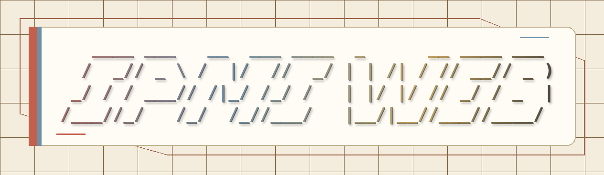
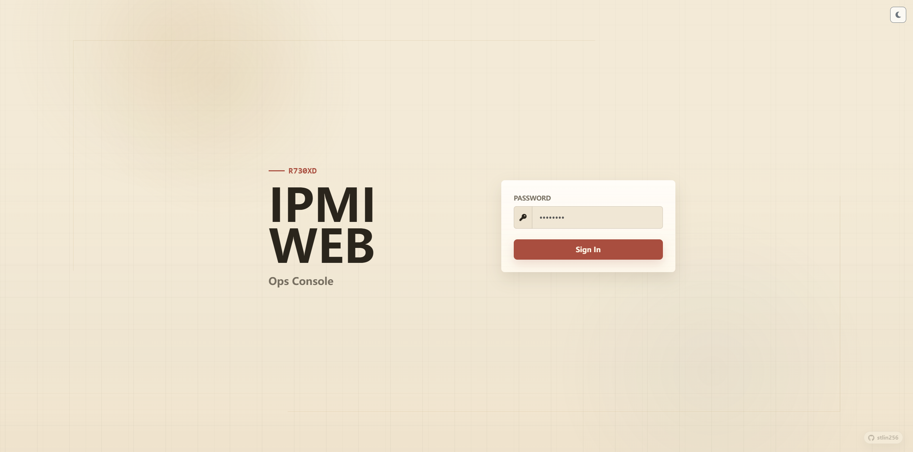
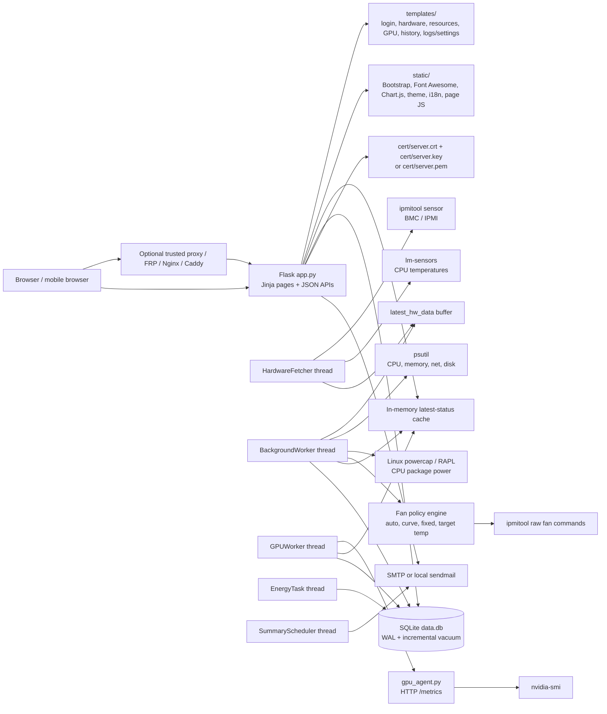
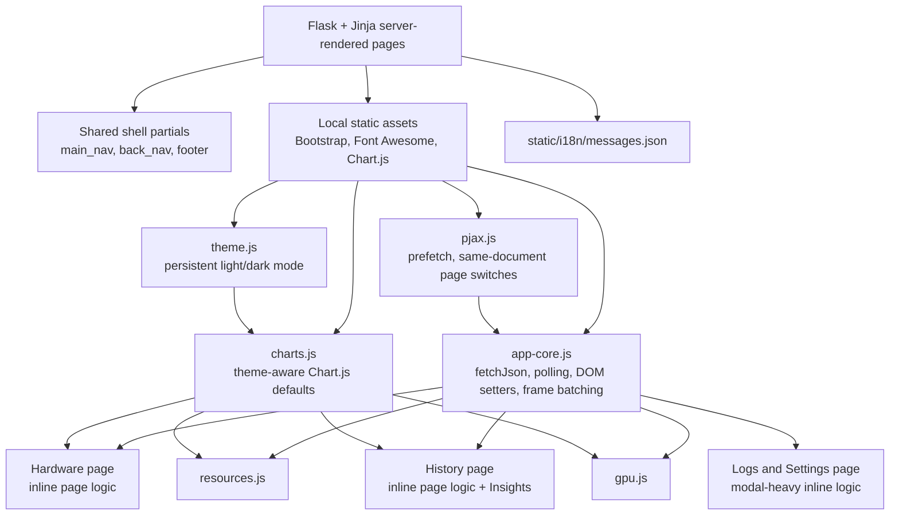
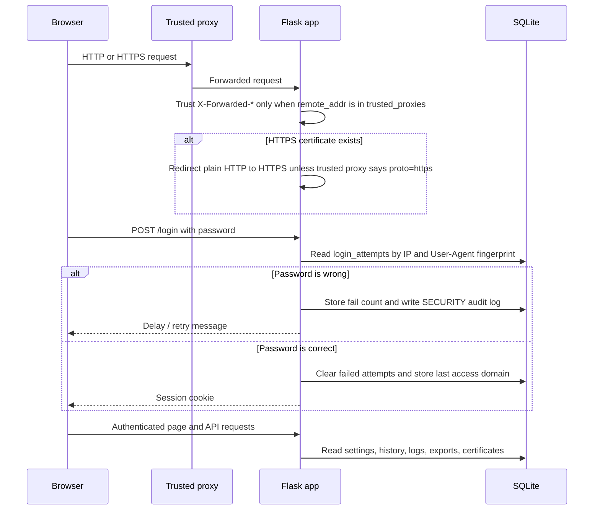
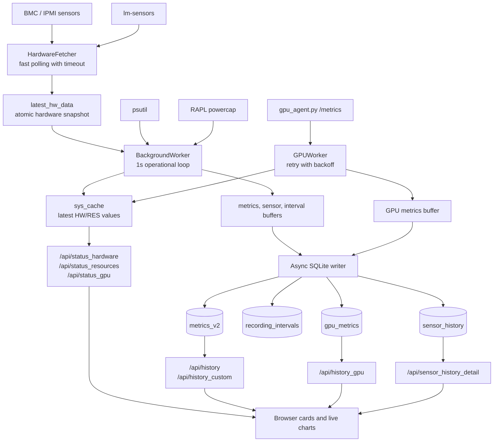
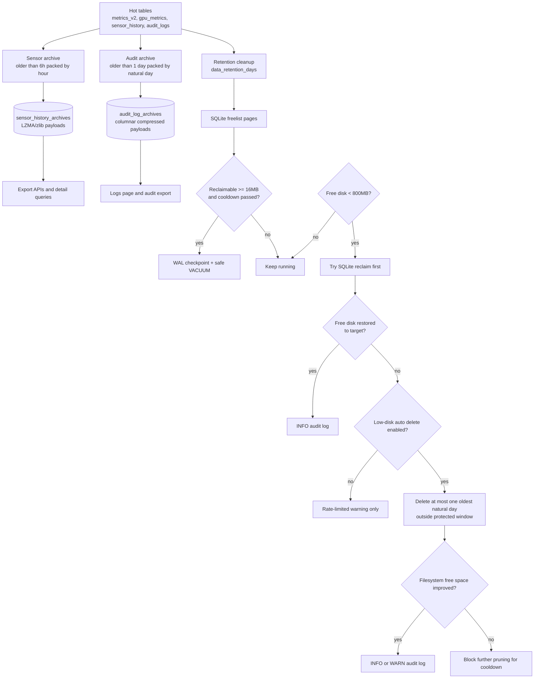

# IPMI_WEB

[](https://deepwiki.com/stlin256/IPMI_WEB)



IPMI_WEB is a lightweight self-hosted operations panel for IPMI-capable servers. It brings hardware telemetry, fan policy control, system resource charts, optional NVIDIA GPU telemetry, historical analysis, audit logs, storage lifecycle management, certificate handling, alerting, and summary emails into one browser interface.

[中文文档](readme-cn.md) | [Changelog](CHANGELOG.md) | [Frontend modernization notes](docs/frontend-modernization-plan.md)

## Current Status

Current application version: `1.6.0`.

The repository has already gone through a front-end modernization pass. The current UI style is a **light-first, low-saturation industrial operations console**: dense operational screens, 8px-radius panels, neutral system surfaces, restrained blue/teal/green/amber/red accents, sticky compact navigation, local Bootstrap/Font Awesome/Chart.js assets, persistent light/dark switching through `static/js/theme.js`, and prefetched PJAX navigation through `static/js/pjax.js`. The app is still Flask/Jinja server-rendered and intentionally does not use a JavaScript bundler yet.

The front-end refactor currently includes:

- Shared visual tokens and responsive rules in `static/css/app-modern.css`.
- Shared page helpers in `static/js/app-core.js`.
- Shared Chart.js theme defaults in `static/js/charts.js`.
- Prefetched PJAX page switching with page cleanup for timers, listeners, Bootstrap instances, and Chart.js instances.
- Persistent light/dark mode, now light by default.
- Extracted navigation and footer partials.
- Page-level scripts already split for Resources and GPU, while larger Hardware, History, and Logs/Settings pages still contain more inline code and remain migration targets.



## Project Background

IPMI_WEB started as a practical control panel for the author's **DELL PowerEdge R730xd**. Used enterprise servers are reliable, expandable, and affordable, but their default BMC fan behavior can be loud in a home lab, office, NAS shelf, or quiet rack. Usually the goal is not to replace iDRAC, iLO, IPMI, or the BMC. The goal is to make daily operation less painful: open one browser page, check temperatures and power, adjust fan policy when needed, review long-range charts, and keep an audit trail of important actions.

That is the design center of IPMI_WEB. It stays small, self-hosted, and easy to inspect. Flask renders the pages, SQLite stores the history, Chart.js draws the trends, `ipmitool` talks to the BMC, `lm-sensors` and `psutil` fill in host metrics, and an optional `gpu_agent.py` exposes NVIDIA telemetry from a host or VM where `nvidia-smi` is available.

## What It Does

| Area | Main capability | Why it exists |
| --- | --- | --- |
| Hardware dashboard | CPU temperature, IPMI power, fan RPM, sensor list, fan mode | See whether the server is healthy right now |
| Fan control | BMC auto mode, manual fan curve, fixed speed, target-temperature mode, calibration | Balance cooling and noise on compatible hardware |
| Resources dashboard | CPU, memory, network, disk I/O, CPU package power | Find the source of current load |
| History explorer | Custom time ranges, backend aggregation, energy statistics, Insights | Understand trends without pushing raw second-level data to the browser |
| GPU dashboard | Optional remote GPU Agent, multi-GPU cards, clocks, power, memory, ECC, trends | Debug throttling, power caps, thermal limits, and utilization |
| Audit logs | Login, settings, certificate, fan, GPU, storage, alert, system events | Know what happened and who triggered it |
| Settings | Server name, language, charts, retention, alerts, email, summaries, certificates | Keep long-running deployments manageable |
| Storage lifecycle | Hot tables, compressed archives, retention cleanup, safe SQLite reclaim, low-disk guardrails | Keep `data.db` useful without letting it grow forever |
| Security basics | Login delay, anti-bruteforce tracking, trusted proxy handling, HTTPS cookies, secret masking | Make reverse-proxy and remote access deployments less fragile |
| i18n | Browser-language first run, then pinned Chinese or English | Keep pages, logs, emails, and release notes in one language |

## Architecture

### Runtime Topology


```mermaid
flowchart LR
    Browser["Browser / mobile browser"] --> Proxy["Optional trusted proxy / FRP / Nginx / Caddy"]
    Proxy --> Flask["Flask app.py<br/>Jinja pages + JSON APIs"]
    Browser --> Flask

    Flask --> Templates["templates/<br/>login, hardware, resources, GPU, history, logs/settings"]
    Flask --> Static["static/<br/>Bootstrap, Font Awesome, Chart.js, theme, i18n, page JS"]
    Flask --> Cache["In-memory latest-status cache"]
    Flask --> DB[("SQLite data.db<br/>WAL + incremental vacuum")]
    Flask --> Cert["cert/server.crt + cert/server.key<br/>or cert/server.pem"]

    HardwareFetcher["HardwareFetcher thread"] --> IPMI["ipmitool sensor<br/>BMC / IPMI"]
    HardwareFetcher --> LMSensors["lm-sensors<br/>CPU temperatures"]
    HardwareFetcher --> LatestHW["latest_hw_data buffer"]

    BackgroundWorker["BackgroundWorker thread"] --> LatestHW
    BackgroundWorker --> Psutil["psutil<br/>CPU, memory, net, disk"]
    BackgroundWorker --> RAPL["Linux powercap / RAPL<br/>CPU package power"]
    BackgroundWorker --> FanPolicy["Fan policy engine<br/>auto, curve, fixed, target temp"]
    FanPolicy --> IPMIRaw["ipmitool raw fan commands"]
    BackgroundWorker --> Cache
    BackgroundWorker --> DB

    GPUWorker["GPUWorker thread"] --> GPUAgent["gpu_agent.py<br/>HTTP /metrics"]
    GPUAgent --> NvidiaSMI["nvidia-smi"]
    GPUWorker --> Cache
    GPUWorker --> DB

    EnergyTask["EnergyTask thread"] --> DB
    SummaryTask["SummaryScheduler thread"] --> Mail["SMTP or local sendmail"]
    Flask --> Mail
```

### Front-End Shape


```mermaid
flowchart TD
    ServerPages["Flask + Jinja server-rendered pages"] --> SharedShell["Shared shell partials<br/>main_nav, back_nav, footer"]
    ServerPages --> LocalAssets["Local static assets<br/>Bootstrap, Font Awesome, Chart.js"]
    ServerPages --> I18nCatalog["static/i18n/messages.json"]

    LocalAssets --> Theme["theme.js<br/>persistent light/dark mode"]
    LocalAssets --> Core["app-core.js<br/>fetchJson, polling, DOM setters, frame batching"]
    LocalAssets --> ChartDefaults["charts.js<br/>theme-aware Chart.js defaults"]
    LocalAssets --> PJAX["pjax.js<br/>prefetch, same-document page switches"]

    PJAX --> Core
    Core --> HardwarePage["Hardware page<br/>inline page logic"]
    Core --> HistoryPage["History page<br/>inline page logic + Insights"]
    Core --> LogsPage["Logs and Settings page<br/>modal-heavy inline logic"]
    Core --> ResourcesPage["resources.js"]
    Core --> GPUPage["gpu.js"]

    Theme --> ChartDefaults
    ChartDefaults --> ResourcesPage
    ChartDefaults --> GPUPage
    ChartDefaults --> HardwarePage
    ChartDefaults --> HistoryPage
```

### Request And Security Flow


```mermaid
sequenceDiagram
    participant U as Browser
    participant P as Trusted proxy
    participant A as Flask app
    participant D as SQLite

    U->>P: HTTP or HTTPS request
    P->>A: Forwarded request
    A->>A: Trust X-Forwarded-* only when remote_addr is in trusted_proxies
    alt HTTPS certificate exists
        A->>A: Redirect plain HTTP to HTTPS unless trusted proxy says proto=https
    end
    U->>A: POST /login with password
    A->>D: Read login_attempts by IP and User-Agent fingerprint
    alt Password is wrong
        A->>D: Store fail count and write SECURITY audit log
        A-->>U: Delay / retry message
    else Password is correct
        A->>D: Clear failed attempts and store last access domain
        A-->>U: Session cookie
    end
    U->>A: Authenticated page and API requests
    A->>D: Read settings, history, logs, exports, certificates
```

### Collection And Chart Data Flow


```mermaid
flowchart TD
    IPMI["BMC / IPMI sensors"] --> Fetcher["HardwareFetcher<br/>fast polling with timeout"]
    Sensors["lm-sensors"] --> Fetcher
    Fetcher --> HWBuffer["latest_hw_data<br/>atomic hardware snapshot"]

    HWBuffer --> Worker["BackgroundWorker<br/>1s operational loop"]
    Psutil["psutil"] --> Worker
    RAPL["RAPL powercap"] --> Worker
    Worker --> Cache["sys_cache<br/>latest HW/RES values"]
    Worker --> Buffers["metrics, sensor, interval buffers"]
    Buffers --> Writer["Async SQLite writer"]
    Writer --> Metrics[("metrics_v2")]
    Writer --> SensorHot[("sensor_history")]
    Writer --> Intervals[("recording_intervals")]

    GPUAgent["gpu_agent.py /metrics"] --> GPUWorker["GPUWorker<br/>retry with backoff"]
    GPUWorker --> Cache
    GPUWorker --> GPUBuffer["GPU metrics buffer"]
    GPUBuffer --> Writer
    Writer --> GPUMetrics[("gpu_metrics")]

    Cache --> StatusAPIs["/api/status_hardware<br/>/api/status_resources<br/>/api/status_gpu"]
    Metrics --> HistoryAPI["/api/history<br/>/api/history_custom"]
    GPUMetrics --> GPUHistoryAPI["/api/history_gpu"]
    SensorHot --> SensorDetailAPI["/api/sensor_history_detail"]
    StatusAPIs --> Charts["Browser cards and live charts"]
    HistoryAPI --> Charts
    GPUHistoryAPI --> Charts
    SensorDetailAPI --> Charts
```

### Storage Lifecycle


```mermaid
flowchart TD
    HotTables["Hot tables<br/>metrics_v2, gpu_metrics, sensor_history, audit_logs"] --> Retention["Retention cleanup<br/>data_retention_days"]
    HotTables --> SensorArchive["Sensor archive<br/>older than 6h packed by hour"]
    HotTables --> AuditArchive["Audit archive<br/>older than 1 day packed by natural day"]

    SensorArchive --> ArchiveTables[("sensor_history_archives<br/>LZMA/zlib payloads")]
    AuditArchive --> ArchiveTables2[("audit_log_archives<br/>columnar compressed payloads")]

    Retention --> Freelist["SQLite freelist pages"]
    ArchiveTables --> Export["Export APIs and detail queries"]
    ArchiveTables2 --> Logs["Logs page and audit export"]

    Freelist --> AutoReclaim{"Reclaimable >= 16MB<br/>and cooldown passed?"}
    AutoReclaim -->|yes| Vacuum["WAL checkpoint + safe VACUUM"]
    AutoReclaim -->|no| Wait["Keep running"]

    DiskGuard{"Free disk < 800MB?"} -->|no| Wait
    DiskGuard -->|yes| Preflight["Try SQLite reclaim first"]
    Preflight --> Restored{"Free disk restored<br/>to target?"}
    Restored -->|yes| AuditInfo["INFO audit log"]
    Restored -->|no| LowDiskEnabled{"Low-disk auto delete enabled?"}
    LowDiskEnabled -->|no| Notice["Rate-limited warning only"]
    LowDiskEnabled -->|yes| Prune["Delete at most one oldest natural day<br/>outside protected window"]
    Prune --> Gain{"Filesystem free space improved?"}
    Gain -->|yes| AuditPrune["INFO or WARN audit log"]
    Gain -->|no| Block["Block further pruning for cooldown"]
```

## Core Pages

| Route | Page | Notes |
| --- | --- | --- |
| `/setup` | First-run setup wizard | One-time token flow created by the installer |
| `/login` | Login | Password login with progressive delay and audit logging |
| `/hardware` | Hardware dashboard | Default authenticated landing page |
| `/resources` | Resource dashboard | CPU, memory, network, disk, CPU package power |
| `/gpu` | GPU monitoring | Requires optional GPU Agent to be enabled |
| `/history` | Historical analysis | Custom ranges, energy, Insights, metric toggles |
| `/logs` | Logs and Settings | Audit log terminal, settings modal, config import/export |

Important API families:

- `/api/status_*` returns latest in-memory status.
- `/api/history`, `/api/history_custom`, `/api/history_gpu`, `/api/sensor_history_detail` return chart data with downsampling or backend aggregation.
- `/api/settings`, `/api/config`, `/api/config/gpu`, `/api/alert_rules` manage runtime settings.
- `/api/setup/complete` saves first-run setup values and creates the first logged-in session.
- `/api/storage_status`, `/api/export_data`, `/api/config/export`, `/api/config/import` support maintenance and portability.
- `/api/certificate` validates and saves HTTPS certificate files.
- `/api/update_notice` and `/api/release_notes` expose version notices from `CHANGELOG.md`.

## Data Model

| Table | Purpose |
| --- | --- |
| `config` | Runtime settings, software version, UI language, retention, email, summary, GPU Agent, fan mode |
| `metrics_v2` | Hardware and resource samples: CPU temp, fan RPM, system power, CPU power, CPU/memory/network/disk |
| `gpu_metrics` | Per-GPU samples: temp, utilization, memory, power, clocks, fan, ECC |
| `sensor_history` | Recent full sensor snapshots as compressed blobs |
| `sensor_history_archives` | Older sensor snapshots packed into hourly compressed archive blocks |
| `energy_hourly` | Hourly energy integration cache in Wh |
| `audit_logs` | Recent audit events |
| `audit_log_archives` | Older audit events packed by natural day |
| `login_attempts` | Anti-bruteforce state keyed by client fingerprint |
| `recording_intervals` | Collection loop interval history |
| `alert_rules` and `alert_status` | Alert configuration and active/recovery state |

SQLite runs in WAL mode and uses incremental vacuum support. Long-running deployments should still monitor disk capacity, because history tables grow with sampling time and enabled telemetry.

## Quick Start

### Interactive Install

For a normal deployment, clone the repository and run the interactive installer. Pressing Enter accepts the shown default value for each prompt.

```bash
git clone https://github.com/stlin256/IPMI_WEB.git
cd IPMI_WEB
sudo bash scripts/install-linux.sh
```

The Linux installer:

- checks that it is running as root, so it does not fail later on systems without usable `sudo`;
- installs Python, `ipmitool`, `lm-sensors`, Git, rsync, and the Python requirements;
- asks for the HTTP port, install directory, data directory, systemd service name, and service user;
- writes `config.json` and `install.json`, including the first-run setup mode flag;
- enables and starts a systemd service;
- prints a URL like `http://server-ip:90/setup`.

Open that setup URL in a browser. The setup wizard configures the display server name, administrator password, database retention, low disk space protection, optional GPU Agent, optional SMTP alerts, automatic update mode, and the update channel. The default channel is `release`; switch to `dev` only when you want updates that track commits on `main`. After completion it signs you in automatically and enters `/hardware`.

On Windows, run PowerShell as Administrator:

```powershell
git clone https://github.com/stlin256/IPMI_WEB.git
cd IPMI_WEB
.\scripts\install-windows.ps1
```

The Windows installer uses an elevated scheduled task as the startup manager because this Python app is not yet packaged as a native Windows Service. It uses the same setup wizard and writes the same `config.json`, `install.json`, and one-time token files.

### Release Packages

`.github/workflows/release.yml` is a manual GitHub Actions workflow for the `release` update channel. Run **Release Package** from the Actions tab, enter a version such as `1.6.1`, and choose the target ref to package. The workflow validates the app, builds `ipmi-web-<version>.zip`, generates a `.sha256` file and a release manifest, then publishes all three files to a GitHub Release tagged `v<version>`.

### Manual Development Run

```bash
sudo apt-get update
sudo apt-get install -y ipmitool lm-sensors

python -m venv .venv
source .venv/bin/activate
pip install -r requirements.txt

cp config.json.example config.json
python app.py
```

Open:

```text
http://your-server-ip:90
```

Minimal `config.json`:

```json
{
  "DATABASE": {
    "path": "/opt/IPMI_WEB/data.db",
    "retention_days": 7
  },
  "SERVER": {
    "port": 90,
    "server_name": "R730XD"
  },
  "SECURITY": {
    "login_password": "change_this_password",
    "trusted_proxies": []
  }
}
```

Most runtime settings are stored in SQLite after first launch. `config.json` remains the bootstrap file for database path, port, server name fallback, login password, and trusted proxy ranges.

## HTTPS

Place either split certificate files:

```text
cert/server.crt
cert/server.key
```

or a combined PEM file:

```text
cert/server.pem
```

When a certificate is present, the app enables secure cookies and redirects plain HTTP to HTTPS unless the request comes from a trusted proxy with `X-Forwarded-Proto: https`.

The Settings page can also upload and validate certificate/key files. The backend checks PEM format, validity dates, and private-key matching before saving.

## Trusted Proxies

If IPMI_WEB is behind FRP, Nginx, Caddy, or another reverse proxy, configure `trusted_proxies` precisely. The app only trusts `X-Forwarded-For` and `X-Forwarded-Proto` when the direct peer is inside one of these networks.

```json
{
  "SECURITY": {
    "login_password": "change_this_password",
    "trusted_proxies": ["127.0.0.1/32", "10.0.0.0/8"]
  }
}
```

Do not trust forwarded headers for direct public exposure. A client can forge those headers unless a trusted proxy strips and rewrites them.

## Optional GPU Agent

Run the agent on the machine that has `nvidia-smi` access:

```bash
python gpu_agent.py
```

Default endpoint:

```text
http://agent-host:9999/metrics
```

Then enable it from the GPU page settings. The main app polls the agent, records GPU history, writes online/offline audit events, and backs off retries up to 30 seconds when the agent is unavailable.

## Alerts And Email

The Settings page supports threshold alert rules with severity, duration, and notification interval. Email delivery can use either:

- SMTP with SSL/TLS or STARTTLS fallback.
- Local Linux `sendmail` in MTA mode.

Summary reports can be scheduled daily, weekly, or at a custom interval. Reports include hardware/resource statistics and optional chart images generated server-side.

## Storage Notes

- Default hot data retention starts at 7 days.
- Shortening retention is delayed by 3 days so accidental destructive changes can be reversed.
- Full sensor history keeps the latest 6 hours in the hot table; older rows are compressed into hourly archives.
- Audit logs older than 1 day are compressed into daily archives.
- New archive payloads prefer LZMA with a codec prefix while preserving zlib compatibility.
- SQLite reclaim runs automatically when reclaimable space reaches 16MB and the cooldown has passed.
- Low-disk automatic deletion is disabled by default. If enabled, it only acts below 800MB free space, protects at least the last 7 days and the configured retention window, and deletes at most one oldest natural day per run.
- If SQLite compaction is unsafe or pruning does not increase filesystem free space, automatic deletion is blocked for a cooldown period and an audit entry is written.

## Safety Notes

Fan control uses IPMI raw commands and can affect hardware cooling. Validate behavior on your own hardware, keep a fallback path through BMC/iDRAC/iLO or physical access, and do not rely on this panel as the only thermal safety mechanism.

This project is intentionally small and inspectable, but it is still a privileged operations surface. Use a strong login password, run it behind a trusted network or proxy, enable HTTPS for remote access, and keep the host OS secured.
