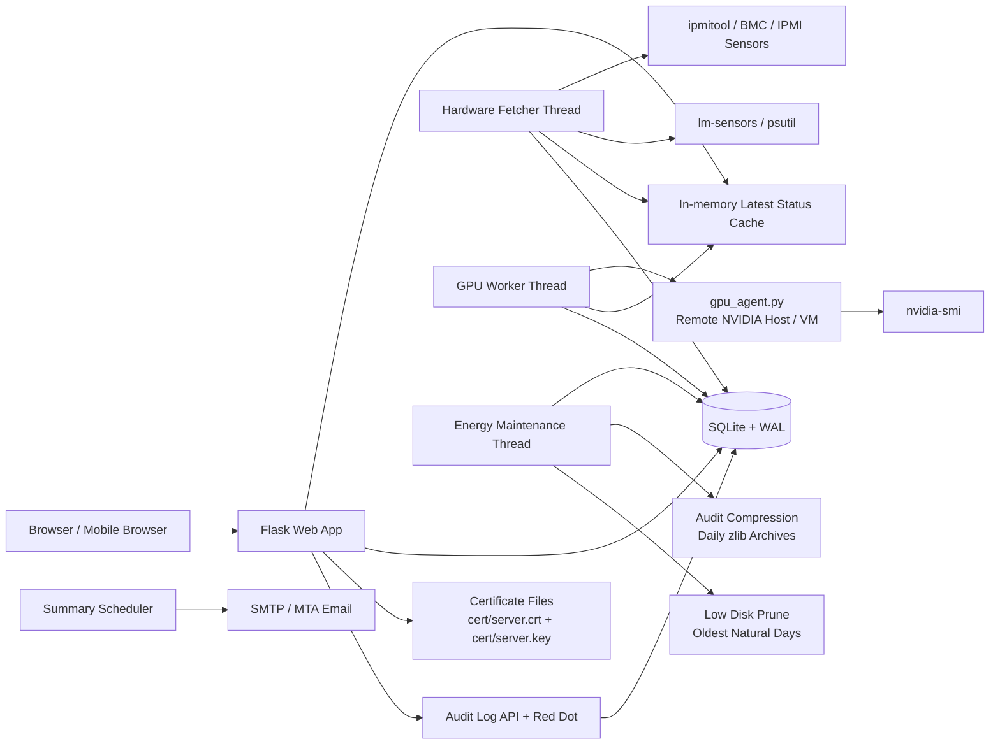
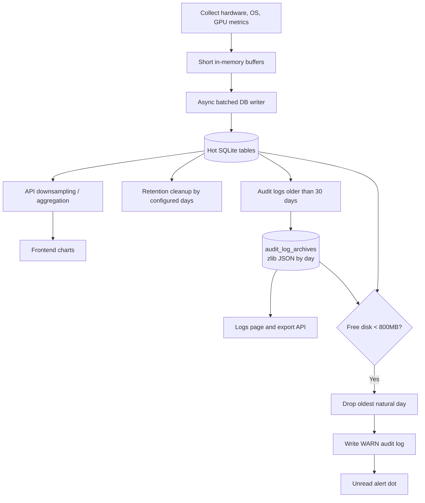
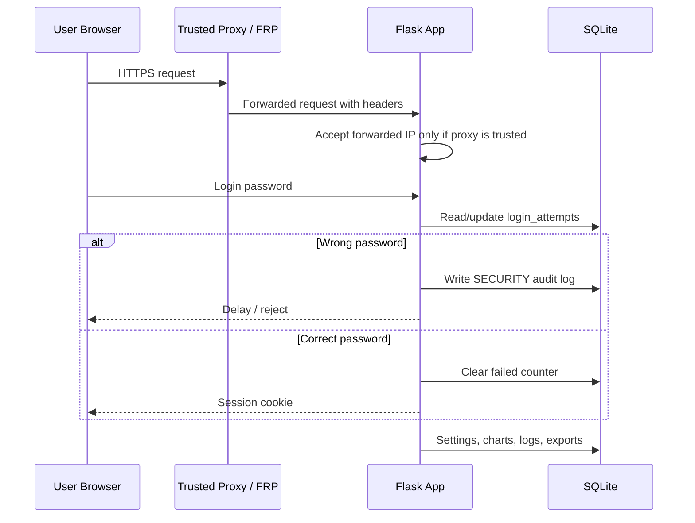
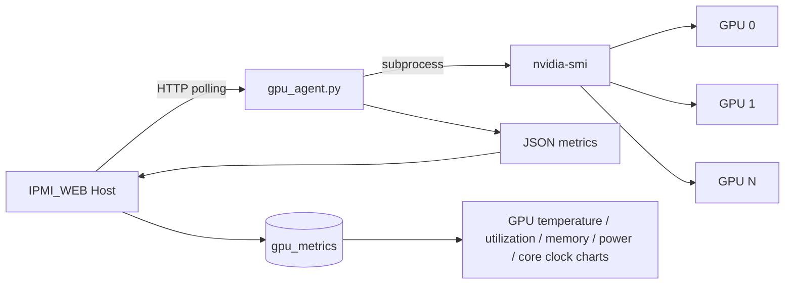

# IPMI_WEB

<p align="center">
  <a href="https://deepwiki.com/stlin256/IPMI_WEB">
    
  </a>
</p>

<p align="center">
  <b>IPMI hardware monitoring, fan control, GPU telemetry, audit logging, storage lifecycle management, and operational reporting in one lightweight web panel.</b>
</p>

<p align="center">
  <a href="#中文说明">中文</a> |
  <a href="#english">English</a> |
  <a href="#mermaid-architecture">Architecture</a> |
  <a href="#quick-start">Quick Start</a>
</p>

> [!IMPORTANT]
> The screenshots in this README are from an ancient early build and are kept only as historical UI references.
> The current application has evolved significantly, especially around history performance, GPU charts, audit logs, certificate management, storage management, update notices, and security hardening.
>
> 本 README 中的截图是远古时期的早期界面截图，仅作为历史参考。当前版本在历史性能、GPU 曲线、审计日志、证书管理、存储管理、版本更新提示与安全防护方面已经有大量变化。

---

## 中文说明

IPMI_WEB 是一个轻量级、可自托管的服务器硬件监控与风扇控制面板。它以 Python Flask 作为后端，通过 `ipmitool`、`lm-sensors`、`psutil`、可选的 GPU Agent 和浏览器端图表，帮助你在一个统一的 Web 界面里观察服务器硬件状态、系统资源、GPU 负载、历史趋势、能耗、审计日志、证书状态和存储健康。

这个项目最初是为作者自己的 **DELL PowerEdge R730xd** 搭建的：这类服务器稳定、耐用，但原厂风扇策略往往偏保守，家庭实验室、办公环境或低噪声机柜中可能会带来过高噪音。IPMI_WEB 的目标不是替代 BMC/iDRAC/iLO，而是在它们之上提供一个更友好的日常运维层：实时看状态、按需调风扇、长周期看趋势、出现安全或存储风险时及时提醒。

它同样可以部署在其他支持 IPMI 或 Linux 传感器采集的服务器/工作站/PC 上。不同硬件的传感器名称、风扇控制方式和权限要求可能不同，部署前建议先确认 `ipmitool sensor`、`ipmitool raw`、`sensors`、`nvidia-smi` 等命令在目标机器上能正常工作。

### 项目适合谁

- 家庭实验室、NAS、虚拟化宿主机、二手企业级服务器用户。
- 希望用浏览器查看硬件状态，而不是反复 SSH 执行命令的管理员。
- 希望降低服务器噪音，同时仍保留温度保护和审计记录的用户。
- 需要观察 1H、6H、24H、7D、30D 甚至更长周期历史曲线的人。
- 使用 GPU 直通、远程 GPU Agent、FRP/反向代理、HTTPS 证书和审计日志的进阶用户。

### 核心能力总览

| 模块 | 能做什么 | 适合回答的问题 |
| --- | --- | --- |
| 硬件首页 | CPU 温度、功耗、风扇转速、传感器列表、风扇模式 | 服务器现在热不热？风扇转得是否合理？ |
| 资源页 | CPU、内存、网络、磁盘 I/O 实时趋势 | 系统瓶颈在哪里？是否有突发负载？ |
| 历史页 | 多时间范围历史图表、能耗统计、Insights 分析 | 过去一段时间温度、功耗、负载如何变化？ |
| GPU 页 | 多 GPU 状态、温度、功耗、显存、核心频率、显存频率、ECC | GPU 是否健康？负载和频率是否匹配？ |
| 风扇控制 | 自动、手动曲线、固定转速、目标温度、校准 | 如何在噪音和散热之间找到平衡？ |
| 审计日志 | 登录、配置、告警、证书、低磁盘清理、系统事件 | 谁做了什么？是否有攻击或异常？ |
| 设置中心 | 存储、邮件、告警、证书、导入导出、保留策略 | 如何配置长期运行和通知？ |
| 存储生命周期 | 数据保留、30 天前审计日志压缩、低磁盘自动清理 | 数据库会不会越跑越大？磁盘满了怎么办？ |
| 安全 | 登录防爆破、可信代理、XSS 防护、敏感配置脱敏、HTTPS | 面板暴露在代理后是否安全？ |

### 古早截图

这些图片来自项目早期版本，界面细节与当前版本并不完全一致。它们保留在这里，是为了帮助新用户快速理解项目最初的使用场景和视觉方向。

<p align="center">
  
  
</p>

<p align="center">
  
  
</p>

<p align="center">
  
  
  
  
</p>

<p align="center">
  
  
</p>

### 页面与功能深入介绍

#### 硬件首页

硬件首页是日常巡检入口。它聚合 CPU 温度、风扇 RPM、功耗、传感器列表、当前风扇模式和关键状态。后台采集线程会持续读取 IPMI 与系统传感器，并把最新状态放入缓存，同时将历史点写入 SQLite。

常见用法：

- 查看当前 CPU 温度与风扇是否处于异常区间。
- 在自动、手动曲线、固定转速、目标温度策略之间切换。
- 根据传感器列表判断是否存在电源、温度、风扇、机箱等硬件告警。
- 进入校准流程，建立 PWM 占空比到实际 RPM 的映射。

#### 资源页

资源页关注操作系统层面的运行状态，包括 CPU 使用率、内存占用、网络吞吐和磁盘 I/O。它与硬件页互补：硬件页告诉你机器是否“热”和“吵”，资源页告诉你系统为什么热、为什么忙。

#### 历史页

历史页用于长周期观察。系统支持多个范围的历史图表，并针对长周期加载做了降采样、聚合和静默后台加载优化。折叠的 Insights 不会阻塞主页面首屏渲染，会在主页面加载完成后后台加载，减少打开历史页时的等待。

历史页可以帮助你判断：

- 某个时间段是否有温度尖峰。
- 风扇转速是否跟随温度合理变化。
- 功耗是否有异常基线抬升。
- CPU/GPU 负载是否和温度、功耗匹配。
- 设备是否有采集中断、断电或长时间离线。

#### GPU 页

GPU 页支持通过 `gpu_agent.py` 采集远端或虚拟机内的 NVIDIA GPU 信息，适合显卡直通、容器、虚拟化或 GPU 不在 Web 主机上的场景。它会展示多张卡的温度、负载、显存、功耗、功耗墙、核心频率、显存频率、风扇和 ECC 错误。

当前 GPU 历史曲线包含核心频率变化曲线，可以把 GPU 频率、温度、功耗和利用率放在一起看。这样更容易发现降频、功耗限制、散热瓶颈或负载不饱和。

#### 审计日志与设置中心

点击服务器名称可进入日志/设置区域。这里包含审计日志、告警规则、存储管理、证书管理、配置导入导出、邮件通知、采集延迟阈值等运维功能。

审计日志记录：

- 登录成功、登录失败、防爆破状态。
- 风扇模式、曲线、固定转速、目标温度等配置变化。
- GPU Agent 上线/离线。
- 证书上传、服务重启请求。
- 数据保留策略变更。
- 低磁盘自动清理事件。
- 系统启动、调度器启动、采集异常等事件。

### 图表怎么读

| 图表 | 主要字段 | 读图重点 |
| --- | --- | --- |
| CPU 温度 | CPU 当前/平均/最高温度 | 温度尖峰、长时间高温、散热策略是否有效 |
| 风扇转速 | RPM、PWM/策略状态 | 风扇是否跟随温度变化，是否出现异常掉速 |
| 功耗 | IPMI 功耗、CPU 功耗、GPU 功耗 | 空闲基线、峰值、任务能耗、功耗墙影响 |
| 系统资源 | CPU、内存、网络、磁盘 I/O | 负载来源和性能瓶颈 |
| GPU | 温度、利用率、显存、功耗、核心频率、显存频率 | 降频、功耗限制、显存瓶颈、散热问题 |
| 能耗 | 每小时 Wh、区间 kWh | 长周期电费估算和任务成本评估 |
| 采集延迟 | 循环间隔、异常 gap | IPMI/BMC 是否卡顿，后台采集是否稳定 |
| Insights | 负载分布、温度分布、能效、GPU 气泡图 | 从大量秒级点中看结构性趋势 |

### 存储生命周期

IPMI_WEB 会持续写入秒级或近秒级历史数据，因此长期运行必须考虑数据库体积。当前版本的策略分为三层：

1. 热数据保留：常规历史表按照设置中的保留天数清理。
2. 审计日志压缩：30 天以前的审计日志按自然日压缩归档，日志页和导出仍可读取归档内容。
3. 低磁盘保护：当数据库所在磁盘剩余空间低于 800MB 时，系统会按最早自然日逐批丢弃历史数据，并为每次丢弃写入 WARN 审计日志，触发提醒红点。

### 证书管理

系统会检测 `cert/server.crt` 与 `cert/server.key`。存在有效证书时，服务会启用 HTTPS，并对 HTTP 请求执行跳转。设置页支持上传 PEM 证书和私钥，上传后会显示证书过期时间，并使用项目内渲染的确认弹窗询问是否立即重启服务。

### FRP、反向代理和真实 IP

如果服务直接部署在 FRP、Nginx、Caddy、Traefik 或其他反向代理后面，请正确配置 `trusted_proxies`。系统只会在请求来自可信代理网段时读取 `X-Forwarded-For` / `X-Forwarded-Proto` 这类头部，否则会使用直接连接 IP。

示例：

```json
{
  "SECURITY": {
    "login_password": "change_me",
    "trusted_proxies": ["127.0.0.1/32", "10.0.0.0/8"]
  }
}
```

如果你通过 FRP 访问且所有请求都显示为 `127.0.0.1`，可以把本机代理地址加入 `trusted_proxies`，前提是你的代理会正确设置并清洗转发头。不要在公网直连场景盲目信任任意 `X-Forwarded-For`。

---

## Mermaid Architecture

### System overview


```mermaid
flowchart LR
    Browser["Browser / Mobile Browser"] --> Flask["Flask Web App"]
    Flask --> Cache["In-memory Latest Status Cache"]
    Flask --> SQLite[("SQLite + WAL")]
    Flask --> Cert["Certificate Files\ncert/server.crt + cert/server.key"]

    HW["Hardware Fetcher Thread"] --> IPMI["ipmitool / BMC / IPMI Sensors"]
    HW --> Sensors["lm-sensors / psutil"]
    HW --> Cache
    HW --> SQLite

    GPUWorker["GPU Worker Thread"] --> GPUAgent["gpu_agent.py\nRemote NVIDIA Host / VM"]
    GPUAgent --> Nvidia["nvidia-smi"]
    GPUWorker --> Cache
    GPUWorker --> SQLite

    Energy["Energy Maintenance Thread"] --> SQLite
    Energy --> Archive["Audit Compression\nDaily zlib Archives"]
    Energy --> Prune["Low Disk Prune\nOldest Natural Days"]

    Scheduler["Summary Scheduler"] --> Mail["SMTP / MTA Email"]
    Flask --> Audit["Audit Log API + Red Dot"]
    Audit --> SQLite
```

### Data lifecycle


```mermaid
flowchart TD
    Collect["Collect hardware, OS, GPU metrics"] --> Buffer["Short in-memory buffers"]
    Buffer --> Write["Async batched DB writer"]
    Write --> Hot[("Hot SQLite tables")]
    Hot --> Downsample["API downsampling / aggregation"]
    Downsample --> Charts["Frontend charts"]

    Hot --> Retention["Retention cleanup by configured days"]
    Hot --> AuditArchive["Audit logs older than 30 days"]
    AuditArchive --> Compressed[("audit_log_archives\nzlib JSON by day")]
    Compressed --> Logs["Logs page and export API"]

    Hot --> LowDisk{"Free disk < 800MB?"}
    Compressed --> LowDisk
    LowDisk -->|Yes| DropDay["Drop oldest natural day"]
    DropDay --> Warn["Write WARN audit log"]
    Warn --> RedDot["Unread alert dot"]
```

### Request and security flow


```mermaid
sequenceDiagram
    participant U as User Browser
    participant P as Trusted Proxy / FRP
    participant A as Flask App
    participant DB as SQLite

    U->>P: HTTPS request
    P->>A: Forwarded request with headers
    A->>A: Accept forwarded IP only if proxy is trusted
    U->>A: Login password
    A->>DB: Read/update login_attempts
    alt Wrong password
        A->>DB: Write SECURITY audit log
        A-->>U: Delay / reject
    else Correct password
        A->>DB: Clear failed counter
        A-->>U: Session cookie
    end
    A->>DB: Settings, charts, logs, exports
```

### GPU monitoring topology


```mermaid
flowchart LR
    Web["IPMI_WEB Host"] -->|HTTP polling| Agent["gpu_agent.py"]
    Agent -->|subprocess| SMI["nvidia-smi"]
    SMI --> GPU0["GPU 0"]
    SMI --> GPU1["GPU 1"]
    SMI --> GPUN["GPU N"]
    Agent --> Metrics["JSON metrics"]
    Metrics --> Web
    Web --> DB[("gpu_metrics")]
    DB --> Chart["GPU temperature / utilization / memory / power / core clock charts"]
```

---

## Quick Start

### Requirements

- Python 3.9+ recommended.
- Linux host for full IPMI and sensor support.
- `ipmitool` for IPMI sensor and fan control.
- `lm-sensors` for local CPU/sensor readings.
- `psutil` Python package for OS resource metrics.
- Optional: NVIDIA driver and `nvidia-smi` on the GPU machine for GPU Agent.

### Install

```bash
sudo apt-get update
sudo apt-get install -y ipmitool lm-sensors

python -m venv .venv
source .venv/bin/activate
pip install Flask psutil
```

### Configure

```bash
cp config.json.example config.json
```

Edit `config.json`:

```json
{
  "DATABASE": {
    "path": "/opt/IPMI_WEB/data.db",
    "retention_days": 7
  },
  "SERVER": {
    "port": 90,
    "server_name": "R730XD"
  },
  "SECURITY": {
    "login_password": "your_password_here",
    "trusted_proxies": []
  }
}
```

### Run

```bash
python app.py
```

Open:

```text
http://your-server-ip:90
```

### Optional HTTPS

Place certificate files here:

```text
cert/server.crt
cert/server.key
```

Then restart the service. You can also upload PEM files from Settings -> Certificate Management.

### Optional GPU Agent

On the GPU host or VM:

```bash
python gpu_agent.py
```

Then open the GPU page in IPMI_WEB, set the GPU Agent host and port, and enable GPU monitoring.

---

## English

IPMI_WEB is a lightweight self-hosted web panel for server hardware monitoring, fan control, GPU telemetry, historical analysis, audit logging, certificate management, and storage lifecycle management. It uses Flask on the backend, SQLite with WAL for local persistence, system tools such as `ipmitool` and `lm-sensors` for hardware data, `psutil` for OS resource metrics, and an optional GPU Agent for NVIDIA GPU data.

The project was originally created for a **DELL PowerEdge R730xd**. Enterprise servers are reliable and inexpensive on the second-hand market, but their default fan policies can be too aggressive for a home lab, office, or quiet rack. IPMI_WEB adds a practical daily-operation layer above the BMC: watch live status, tune fan behavior, inspect long-term trends, receive warnings, and keep enough audit history to understand what happened.

IPMI_WEB is not a replacement for iDRAC, iLO, IPMI, or your BMC. It is a companion panel focused on convenience, observability, and controlled automation.

### Who it is for

- Home lab, NAS, virtualization host, workstation, and second-hand enterprise server users.
- Operators who want browser-based visibility instead of repeated SSH commands.
- Users who want quieter fan behavior without losing observability.
- People who need long-range trends across 1H, 6H, 24H, 7D, 30D, and beyond.
- Advanced users running reverse proxies, FRP, HTTPS, GPU passthrough, and audit-heavy setups.

### Feature map

| Area | What it provides | Typical question |
| --- | --- | --- |
| Hardware dashboard | CPU temperature, power, fan RPM, IPMI sensors, fan mode | Is the machine healthy right now? |
| Resource dashboard | CPU, memory, network, disk I/O | What is causing load? |
| History | Multi-range charts, energy, Insights, exports | What happened over time? |
| GPU | Multi-GPU telemetry, memory, power, clocks, ECC | Is the GPU throttling or constrained? |
| Fan control | Auto, manual curve, fixed speed, target temperature, calibration | How do I balance noise and cooling? |
| Audit logs | Login, config, certificate, restart, GPU, storage, security events | Who did what, and when? |
| Settings | Retention, email, alerts, certificates, import/export | How do I operate it long term? |
| Storage lifecycle | Retention, compressed audit archives, low-disk pruning | Will the database grow forever? |
| Security | Anti-bruteforce, trusted proxies, XSS hardening, HTTPS | Can I safely run it behind a proxy? |

### Chart guide

| Chart | Fields | How to read it |
| --- | --- | --- |
| CPU temperature | Current, average, max | Look for spikes, sustained heat, cooling response |
| Fan RPM | RPM and control state | Check if fan speed follows temperature changes |
| Power | IPMI power, CPU power, GPU power | Find idle baseline, task peaks, energy cost |
| Resources | CPU, memory, network, disk I/O | Identify workload and bottleneck patterns |
| GPU | Temperature, utilization, memory, power, core clock, memory clock | Detect throttling, power caps, memory pressure, cooling limits |
| Energy | Hourly Wh and range kWh | Estimate electricity use and workload cost |
| Recording delay | Loop interval and gaps | Detect IPMI/BMC stalls or collector instability |
| Insights | Load distribution, temperature distribution, efficiency, GPU bubbles | Understand long-range behavior from raw samples |

### Operational model

IPMI_WEB is designed as a single-node local service. It keeps the latest readings in memory for fast status APIs and writes historical records to SQLite in batches. Long-range endpoints aggregate or downsample data before returning it to the browser, so charts remain responsive even when the database has many raw samples.

For storage health, recent history stays in hot tables, old audit logs are compressed into daily archives, and emergency low-disk pruning removes the oldest natural days only when free disk space falls below the configured safety threshold.

### Security model

- Failed logins are audited and rate-limited.
- Login attempts are tracked by IP and User-Agent fingerprint.
- Forwarded headers are trusted only when the direct peer is in `trusted_proxies`.
- Sensitive settings such as SMTP password are masked in APIs and exports.
- Audit log rendering is hardened against stored XSS.
- HTTPS can be enabled through certificate files or the certificate management UI.
- WARN, ERROR, and SECURITY audit entries wake the unread alert dot.

### Configuration notes

- `DATABASE.path`: SQLite database location.
- `DATABASE.retention_days`: default historical data retention.
- `SERVER.port`: web service port.
- `SERVER.server_name`: display name in the UI and reports.
- `SECURITY.login_password`: login password.
- `SECURITY.trusted_proxies`: proxy IPs/CIDRs allowed to provide forwarded headers.

### Project files

| Path | Purpose |
| --- | --- |
| `app.py` | Main Flask application, collectors, APIs, maintenance tasks |
| `gpu_agent.py` | Optional NVIDIA GPU metrics agent |
| `cpu_power_probe.py` | CPU power probing helper |
| `hardware_info_probe.py` | Hardware discovery helper |
| `templates/` | HTML pages and email templates |
| `static/` | Bundled CSS, JS, fonts |
| `img/` | Historical README screenshots |
| `config.json.example` | Example runtime configuration |
| `CHANGELOG.md` | Release notes |

---

## Development and operations notes

- The app uses SQLite WAL mode to reduce read/write contention.
- Historical writes are buffered and batched to lower I/O pressure.
- Insights and long-range chart APIs should prefer backend aggregation over returning raw unbounded data.
- Any new configuration key should be initialized in `init_db`, exposed through settings APIs if needed, covered by import/export compatibility, and included in audit logging.
- Version bumps should follow the project policy in `DEVELOPMENT_GUIDE.md`.
- Be careful with fan control commands. Test on your hardware before relying on custom curves.

## Disclaimer

Fan control and IPMI raw commands can affect hardware cooling. Use this project only if you understand your server platform and can verify safe temperatures under load. Always keep a fallback path to your BMC/iDRAC/iLO or physical access when experimenting with fan policies.

风扇控制和 IPMI raw 命令会影响硬件散热。请在理解目标硬件平台的前提下使用，并在负载测试中确认温度安全。调整风扇策略时，建议始终保留 BMC/iDRAC/iLO 或物理访问作为回退方案。
