# IPMI_WEB

<p align="center">
  <a href="https://deepwiki.com/stlin256/IPMI_WEB">
    
  </a>
</p>

<p align="center">
  <b>A lightweight self-hosted panel for IPMI hardware monitoring, fan control, GPU telemetry, historical charts, audit logs, certificates, and storage lifecycle management.</b>
</p>

<p align="center">
  <a href="#中文文档">中文文档</a> |
  <a href="#english-documentation">English Documentation</a> |
  <a href="#古早截图--ancient-screenshots">Screenshots</a> |
  <a href="#changelog">Changelog</a>
</p>

> [!IMPORTANT]
> 本 README 中的截图来自远古时期的早期版本，只用于帮助理解项目最初形态。当前版本的界面、性能、安全、存储和证书管理能力已经明显变化。
>
> Screenshots in this README are from an ancient early build. They are kept as historical UI references only; the current application has changed substantially.

---

## 中文文档

### 项目背景

IPMI_WEB 最初是为作者自己的 **DELL PowerEdge R730xd** 搭建的。二手企业级服务器便宜、稳定、扩展性强，但默认风扇策略常常偏保守，放在家庭实验室、办公室或低噪声环境中会比较吵。很多时候我们并不想完全替代 iDRAC/iLO/BMC，只是希望在日常使用时有一个更顺手的 Web 面板：实时看温度、功耗和风扇，必要时调风扇策略，长周期分析历史曲线，并在登录异常、证书变化、磁盘不足或清理历史日志时留下审计记录。

IPMI_WEB 就是为这个场景做的轻量面板。它基于 Flask、SQLite、Chart.js、`ipmitool`、`lm-sensors`、`psutil` 和可选的 GPU Agent，将硬件状态、系统资源、GPU 指标、历史图表、能耗、证书、设置、审计日志和存储管理整合在一个浏览器界面中。

### 适合的使用场景

- 家庭实验室、NAS、虚拟化宿主机、工作站和二手企业级服务器。
- 希望通过浏览器查看硬件状态，而不是反复 SSH 执行命令的用户。
- 需要在噪音和散热之间找平衡的服务器玩家。
- 需要查看 1H、6H、24H、7D、30D 甚至更长周期历史曲线的运维场景。
- 使用 GPU 直通、远程 GPU Agent、FRP、反向代理、HTTPS 证书和审计日志的进阶部署。

### 功能总览

| 模块 | 主要能力 | 解决的问题 |
| --- | --- | --- |
| 硬件首页 | CPU 温度、功耗、风扇 RPM、传感器、风扇模式 | 服务器现在是否健康，风扇是否合理 |
| 资源页 | CPU、内存、网络、磁盘 I/O 实时趋势 | 当前系统负载来自哪里 |
| 历史页 | 多时间范围曲线、能耗统计、Insights 后台分析 | 长周期观察温度、功耗、负载和采集稳定性 |
| GPU 页 | 多卡温度、利用率、显存、功耗、核心频率、显存频率、ECC | 判断 GPU 是否降频、过热或受功耗限制 |
| 风扇控制 | 自动、手动曲线、固定转速、目标温度、校准 | 在噪音和散热之间做可控调节 |
| 审计日志 | 登录、配置、证书、GPU、低磁盘、系统事件 | 追踪谁在什么时候做了什么 |
| 设置中心 | 图表选项、语言、存储、告警、报告、邮件、证书、关于 | 管理长期运行参数 |
| 存储生命周期 | 热数据保留、审计日志压缩、低磁盘安全回收 | 控制数据库体积，避免磁盘被写满 |
| 安全 | 防爆破、可信代理、敏感字段脱敏、日志 XSS 防护、HTTPS | 让面板更适合放在代理后运行 |
| i18n | 首次跟随浏览器语言，之后可固定中文或英文 | 让界面、日志和更新说明使用一致语言 |

### 页面说明

#### 硬件首页

硬件首页是日常巡检入口。后台线程会定期读取 IPMI 与 Linux 传感器，把最新温度、功耗、风扇转速和传感器状态写入内存缓存，并将历史点批量写入 SQLite。页面会优先加载轻量状态接口，历史小图也会使用聚合后的 `/api/history_custom?energy=0`，避免打开首页时被能耗统计阻塞。

#### 历史页

历史页用于长周期分析。后端会在 SQLite 中先按时间桶聚合，再返回有限数量的图表点，因此 30 Days 这类长周期不需要把所有秒级原始数据直接传到浏览器。折叠的 Insights 会在主图加载后后台静默加载，展开时尽量做到立即显示。

#### GPU 页

GPU 监控通过可选的 `gpu_agent.py` 采集远端或虚拟机内的 NVIDIA 指标。页面展示温度、核心利用率、显存利用率、显存占用、功耗、功耗墙、核心频率、显存频率、风扇和 ECC 错误。当前版本的 GPU 历史曲线包含核心频率曲线，便于排查降频、功耗墙、散热瓶颈和负载不饱和。

#### 设置与审计

日志页同时承担审计和设置入口。设置弹窗会先并行加载轻量配置和告警规则，存储状态、证书状态和更新日志再后台加载，从而减少点击设置按钮后的等待。证书上传会先在后端校验证书格式、有效期和私钥匹配关系，无效则拒绝保存并使用项目内渲染弹窗提示；有效时统一覆盖服务证书文件，并询问是否重启服务。

界面语言首次访问会跟随浏览器语言；保存设置后可固定为中文或英文。登录页、导航、设置、动态提示、审计日志、邮件摘要、普通更新日志和版本更新弹窗都通过统一词表维护，更新说明只显示当前语言内容。

### 图表读法

| 图表 | 字段 | 观察重点 |
| --- | --- | --- |
| CPU 温度 | 当前、平均、最高温度 | 是否持续高温，风扇策略是否有效 |
| 风扇转速 | RPM、控制模式 | 是否随温度变化，是否异常掉速 |
| 功耗 | 系统功耗、CPU 功耗、GPU 功耗 | 空闲基线、峰值、任务能耗 |
| 资源 | CPU、内存、网络、磁盘 I/O | 负载来源和瓶颈 |
| GPU | 温度、利用率、显存、功耗、核心频率、显存频率 | 降频、过热、功耗墙、显存压力 |
| 能耗 | 小时 Wh、区间 kWh、累计 kWh | 长周期电费估算和任务成本 |
| 采集延迟 | 循环间隔、异常 gap | BMC/IPMI 是否卡顿，采集线程是否稳定 |
| Insights | 负载分布、温度分布、能效、GPU 气泡图 | 从大量历史点中看结构性趋势 |

### 存储与压缩策略

IPMI_WEB 会长期写入历史数据，因此必须主动控制数据库体积。当前策略包括：

- 常规历史表按设置中的保留天数清理。
- 传感器全量历史保留近 6 小时热表，较旧数据按小时压缩归档；归档内容仍可在传感器详情曲线和导出接口中读取。
- 审计日志按自然日压缩归档，归档使用更紧凑的列式结构，仍兼容旧归档并可在日志页和导出接口中读取。
- 新写入的压缩数据带格式标记，优先使用高压缩比 LZMA，旧 zlib 数据仍可兼容读取。
- 设置 -> 存储管理中可以查看 `data.db` 文件体积、已存储天数、磁盘剩余空间和 SQLite 可回收空间。
- SQLite 可回收空间会由后台维护自动压缩；达到 16MB 阈值且磁盘空间足够时才执行，避免频繁阻塞数据库。
- 低磁盘自动删除默认关闭。只有管理员在存储管理里显式打开后，系统才会在磁盘剩余空间低于 800MB 时删除历史数据。
- 低磁盘处理会先尝试 SQLite WAL checkpoint 和安全 `VACUUM`，把数据库内部 freelist 真正归还给文件系统；如果空间已恢复，不会删除历史记录。
- 只有在安全回收仍不足时，才会按最早自然日流式丢弃保护窗口之外的历史数据。
- 自动删除至少保护最近 7 天，并且会同时尊重当前数据保留期；单次最多处理 1 个自然日，随后进入冷却期。
- 如果 SQLite 无法安全整理，或删除后文件系统可用空间没有明显增加，系统会熔断后续自动删除并写入保护日志。
- 审计归档、传感器归档、SQLite 压缩和保留期清理都会写入系统审计摘要，日志折叠状态下也能看出处理内容。
- 普通低磁盘清理写 INFO，不触发红点；只有确实丢弃历史审计日志时才写 WARN 并点亮提醒红点。

> [!NOTE]
> 如果看到 `data.db` 文件很大，但存储管理里的“SQLite 可回收空间”也很大，通常说明大量页面已经在数据库内部空闲。后台维护会在达到阈值且空间足够时自动整理数据库文件；“低磁盘自动删除”只控制磁盘不足时是否允许删除更早的历史记录。

### FRP、反向代理和真实 IP

如果通过 FRP、Nginx、Caddy 或其他反向代理访问，请正确配置 `trusted_proxies`。系统只会在直接来源属于可信代理网段时读取 `X-Forwarded-For` 和 `X-Forwarded-Proto`。

```json
{
  "SECURITY": {
    "login_password": "change_me",
    "trusted_proxies": ["127.0.0.1/32", "10.0.0.0/8"]
  }
}
```

如果 FRP 让所有访问都显示为 `127.0.0.1`，可以把本机代理地址加入 `trusted_proxies`，但前提是代理会正确设置并清洗转发头。不要在公网直连服务时盲目信任任意 `X-Forwarded-For`。

### 中文架构图

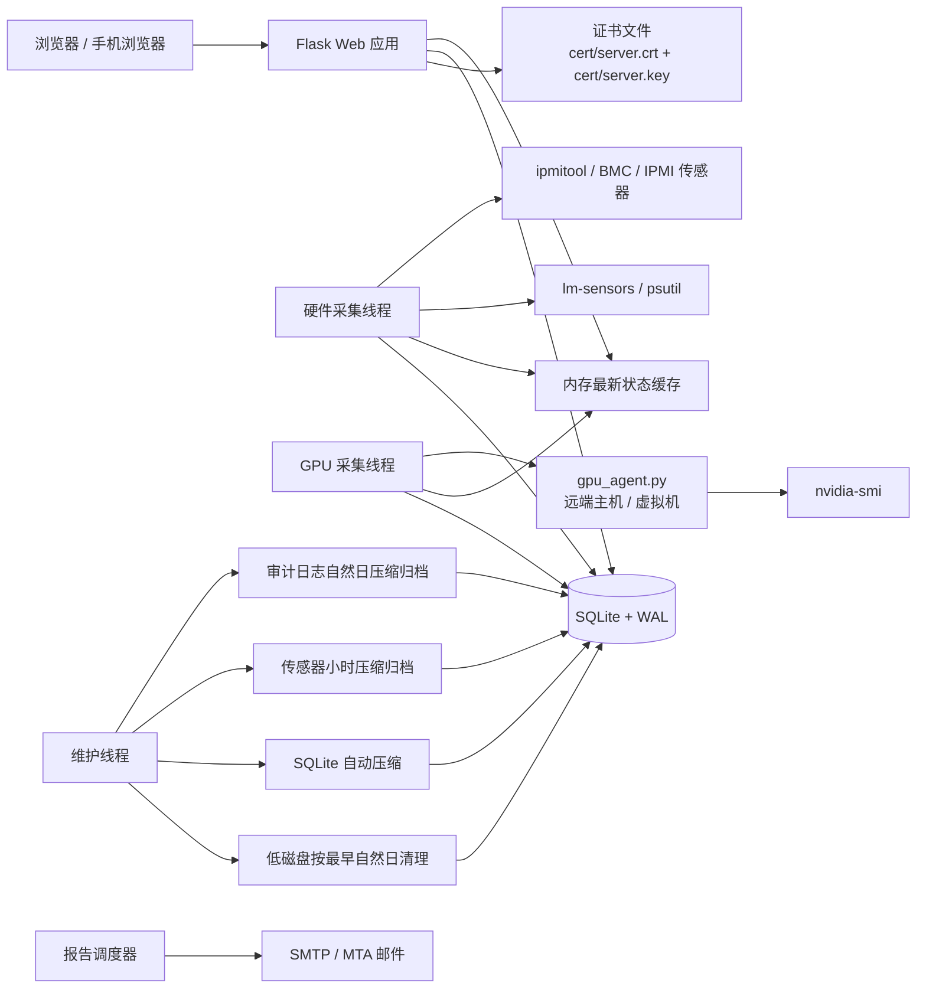
```mermaid
flowchart LR
    Browser["浏览器 / 手机浏览器"] --> Flask["Flask Web 应用"]
    Flask --> Cache["内存最新状态缓存"]
    Flask --> DB[("SQLite + WAL")]
    Flask --> Cert["证书文件\ncert/server.crt + cert/server.key"]

    HW["硬件采集线程"] --> IPMI["ipmitool / BMC / IPMI 传感器"]
    HW --> Sensors["lm-sensors / psutil"]
    HW --> Cache
    HW --> DB

    GPUWorker["GPU 采集线程"] --> Agent["gpu_agent.py\n远端主机 / 虚拟机"]
    Agent --> SMI["nvidia-smi"]
    GPUWorker --> Cache
    GPUWorker --> DB

    Energy["维护线程"] --> Archive["审计日志自然日压缩归档"]
    Energy --> SensorArchive["传感器小时压缩归档"]
    Energy --> Vacuum["SQLite 自动压缩"]
    Energy --> Prune["低磁盘按最早自然日清理"]
    Archive --> DB
    SensorArchive --> DB
    Vacuum --> DB
    Prune --> DB

    Scheduler["报告调度器"] --> Mail["SMTP / MTA 邮件"]
```

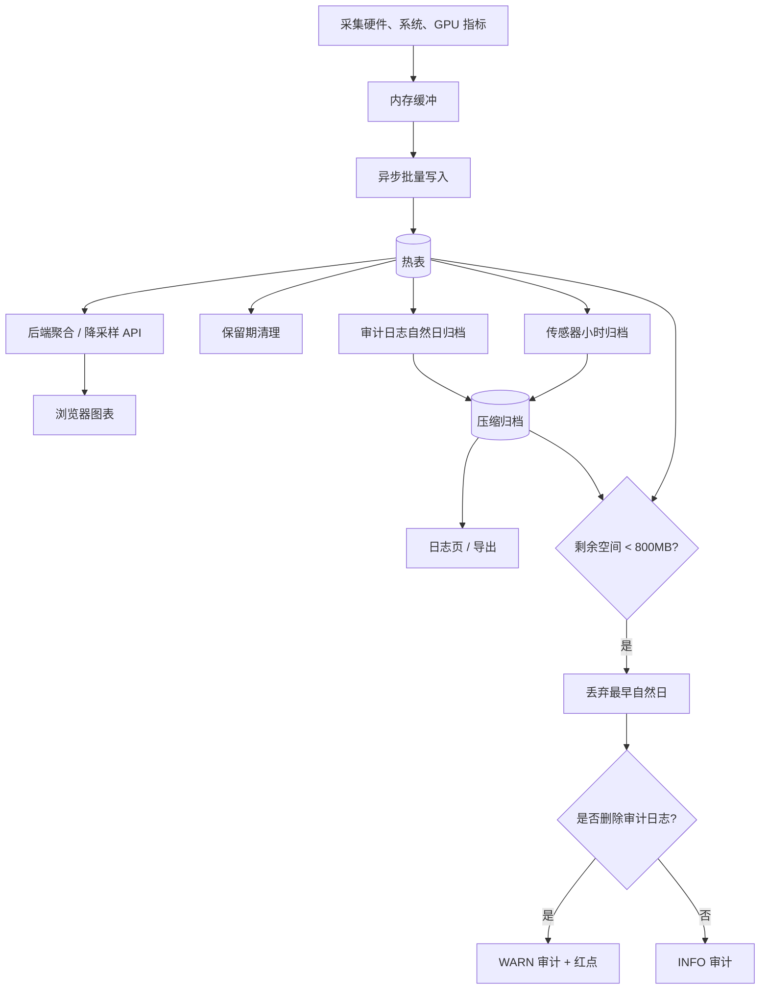
```mermaid
flowchart TD
    Collect["采集硬件、系统、GPU 指标"] --> Buffer["内存缓冲"]
    Buffer --> Writer["异步批量写入"]
    Writer --> Hot[("热表")]
    Hot --> API["后端聚合 / 降采样 API"]
    API --> Charts["浏览器图表"]

    Hot --> Retention["保留期清理"]
    Hot --> AuditArchive["审计日志自然日归档"]
    Hot --> SensorArchive["传感器小时归档"]
    AuditArchive --> Compressed[("压缩归档")]
    SensorArchive --> Compressed
    Compressed --> Logs["日志页 / 导出"]

    Hot --> LowDisk{"剩余空间 < 800MB?"}
    Compressed --> LowDisk
    LowDisk -->|是| Drop["丢弃最早自然日"]
    Drop --> Audit{"是否删除审计日志?"}
    Audit -->|是| Warn["WARN 审计 + 红点"]
    Audit -->|否| Info["INFO 审计"]
```

### 快速开始

```bash
sudo apt-get update
sudo apt-get install -y ipmitool lm-sensors

python -m venv .venv
source .venv/bin/activate
pip install Flask psutil

cp config.json.example config.json
python app.py
```

浏览器访问：

```text
http://your-server-ip:90
```

启用 HTTPS 时放置：

```text
cert/server.crt
cert/server.key
```

GPU Agent 可选运行：

```bash
python gpu_agent.py
```

---

## English Documentation

### Background

IPMI_WEB was originally built for the author's **DELL PowerEdge R730xd**. Second-hand enterprise servers are reliable and expandable, but their default fan policies can be far too aggressive for a home lab, office, or quiet rack. In many cases, you do not want to replace iDRAC, iLO, IPMI, or the BMC. You just want a practical daily panel: inspect temperature, power, fan RPM, long-range charts, certificates, storage health, and audit events from a browser.

IPMI_WEB is that panel. It combines Flask, SQLite, Chart.js, `ipmitool`, `lm-sensors`, `psutil`, and an optional GPU Agent into one self-hosted monitoring and control surface.

### Who should use it

- Home lab, NAS, virtualization host, workstation, and used enterprise server users.
- Operators who prefer browser-based hardware visibility over repeated SSH commands.
- Users who need quieter fan behavior while keeping enough safety visibility.
- People who need 1H, 6H, 24H, 7D, 30D, and longer historical charts.
- Advanced deployments with GPU passthrough, remote GPU agents, FRP, reverse proxies, HTTPS, and audit logs.

### Feature map

| Area | Capability | Question it answers |
| --- | --- | --- |
| Hardware | CPU temperature, power, fan RPM, sensors, fan mode | Is the server healthy right now? |
| Resources | CPU, memory, network, disk I/O | What is causing current load? |
| History | Multi-range charts, energy, Insights | What happened over time? |
| GPU | Temperature, utilization, memory, power, clocks, ECC | Is the GPU throttling or constrained? |
| Fan control | Auto, curve, fixed speed, target temperature, calibration | How do I balance noise and cooling? |
| Audit logs | Login, config, certificates, GPU, storage, system events | Who did what, and when? |
| Settings | Charts, language, retention, alerts, reports, email, certificates, about | How do I operate it long term? |
| Storage | Retention, compressed archives, low-disk safe reclaim | Will the database grow forever? |
| Security | Anti-bruteforce, trusted proxies, masking, XSS hardening, HTTPS | Can I run it behind a proxy safely? |
| i18n | Browser-language first visit, then pinned Chinese or English | Can the UI, logs, and release notes stay in one language? |

### Page guide

The hardware page loads fast status data first and requests history without energy calculation for the small homepage chart. The history page uses backend SQL aggregation to keep responses bounded even for 30-day views. Insights can be preloaded quietly after the main chart so expanding it feels faster without blocking the first render.

The settings modal opens immediately, then loads storage status, certificate status, and release notes in the background. Certificate uploads are validated before saving; invalid files are rejected and shown with the app's rendered modal instead of a browser-native alert.

The UI language follows the browser on the first visit and can later be pinned to Chinese or English in settings. Login, navigation, settings, dynamic messages, audit logs, email summaries, changelog content, and version-update notices are maintained through a shared catalog, and release notes render only in the current language.

### Chart guide

| Chart | Fields | What to look for |
| --- | --- | --- |
| CPU temperature | Current, average, max | Spikes, sustained heat, cooling response |
| Fan RPM | RPM and control mode | Whether fan speed follows temperature |
| Power | System, CPU, GPU power | Idle baseline, peaks, energy cost |
| Resources | CPU, memory, network, disk I/O | Workload source and bottlenecks |
| GPU | Temperature, utilization, memory, power, core clock, memory clock | Throttling, power caps, thermal limits |
| Energy | Hourly Wh and range kWh | Electricity estimate and workload cost |
| Delay | Loop interval and gaps | IPMI/BMC stalls or collector instability |
| Insights | Load distribution, temperature distribution, efficiency, GPU bubbles | Long-range behavior from raw samples |

### Storage model

- Hot history tables are cleaned by the configured retention period.
- Full sensor history keeps the latest 6 hours in the hot table. Older samples are packed into hourly compressed archives that remain readable from sensor detail charts and exports.
- Audit logs are compressed by local natural day using a more compact columnar layout, while existing archives remain compatible and readable from the logs page and export API.
- New compressed payloads use a codec prefix and prefer high-ratio LZMA while retaining legacy zlib compatibility.
- Settings -> Storage Management shows the `data.db` file size, stored data age, free disk space, and SQLite reclaimable space.
- SQLite reclaimable space is compacted automatically by background maintenance once it reaches the 16MB threshold and enough disk space is available, avoiding frequent database stalls.
- Low-disk auto delete is disabled by default. It only deletes history after an administrator explicitly enables it and free disk space drops below 800MB.
- Low-disk handling first runs a WAL checkpoint and safe SQLite `VACUUM` to return freelist pages to the filesystem. If this restores the target free space, no history rows are deleted.
- If safe reclaim is not enough, only complete natural days outside the protection window are discarded.
- The deletion guard always protects at least the latest 7 days and the configured retention window. One run can process at most one natural day before the cooldown applies.
- If SQLite cannot be compacted safely, or deleting rows does not noticeably increase filesystem free space, automatic deletion is blocked and a protection audit entry is written.
- Audit archiving, sensor archiving, SQLite compaction, and retention cleanup all write system audit summaries that are understandable without expanding details.
- Routine low-disk pruning writes INFO. It only writes WARN and wakes the red dot when historical audit logs are actually discarded.

> [!NOTE]
> A large `data.db` with a large “SQLite reclaimable space” value usually means many pages are already free inside SQLite. Background maintenance compacts the database once the threshold is reached and enough disk space is available; “Low-disk Auto Delete” only controls whether older history may be deleted when disk space is actually low.

### English architecture

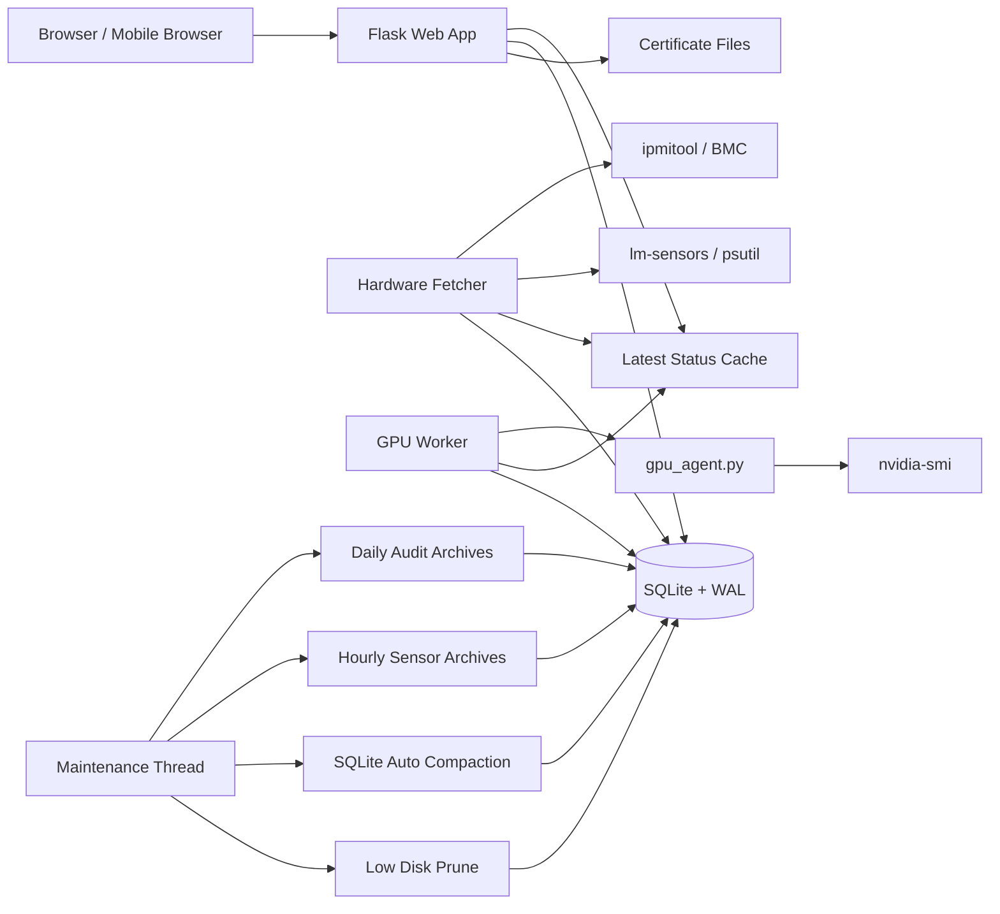
```mermaid
flowchart LR
    Browser["Browser / Mobile Browser"] --> Flask["Flask Web App"]
    Flask --> Cache["Latest Status Cache"]
    Flask --> DB[("SQLite + WAL")]
    Flask --> Cert["Certificate Files"]

    HW["Hardware Fetcher"] --> IPMI["ipmitool / BMC"]
    HW --> Sensors["lm-sensors / psutil"]
    HW --> Cache
    HW --> DB

    GPUWorker["GPU Worker"] --> GPUAgent["gpu_agent.py"]
    GPUAgent --> SMI["nvidia-smi"]
    GPUWorker --> Cache
    GPUWorker --> DB

    Maintenance["Maintenance Thread"] --> Archive["Daily Audit Archives"]
    Maintenance --> SensorArchive["Hourly Sensor Archives"]
    Maintenance --> Vacuum["SQLite Auto Compaction"]
    Maintenance --> Prune["Low Disk Prune"]
    Archive --> DB
    SensorArchive --> DB
    Vacuum --> DB
    Prune --> DB
```

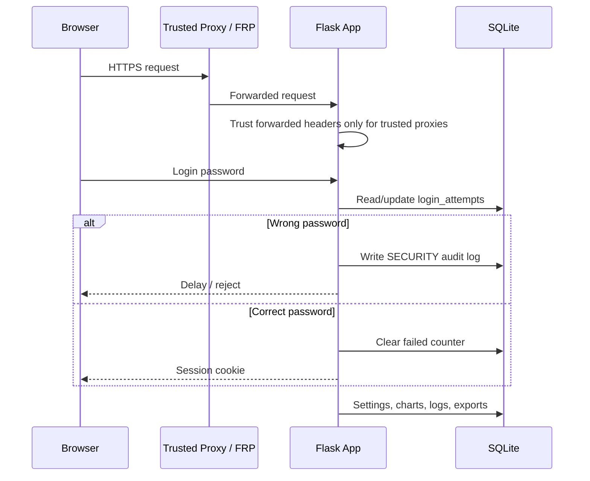
```mermaid
sequenceDiagram
    participant U as Browser
    participant P as Trusted Proxy / FRP
    participant A as Flask App
    participant DB as SQLite

    U->>P: HTTPS request
    P->>A: Forwarded request
    A->>A: Trust forwarded headers only for trusted proxies
    U->>A: Login password
    A->>DB: Read/update login_attempts
    alt Wrong password
        A->>DB: Write SECURITY audit log
        A-->>U: Delay / reject
    else Correct password
        A->>DB: Clear failed counter
        A-->>U: Session cookie
    end
    A->>DB: Settings, charts, logs, exports
```

### Quick start

```bash
sudo apt-get update
sudo apt-get install -y ipmitool lm-sensors

python -m venv .venv
source .venv/bin/activate
pip install Flask psutil

cp config.json.example config.json
python app.py
```

Open:

```text
http://your-server-ip:90
```

Optional HTTPS:

```text
cert/server.crt
cert/server.key
```

Optional GPU Agent:

```bash
python gpu_agent.py
```

---

## 古早截图 / Ancient Screenshots

这些截图是远古时期的早期界面截图，仅作历史参考。They are ancient screenshots and do not fully represent the current UI.

<p align="center">
  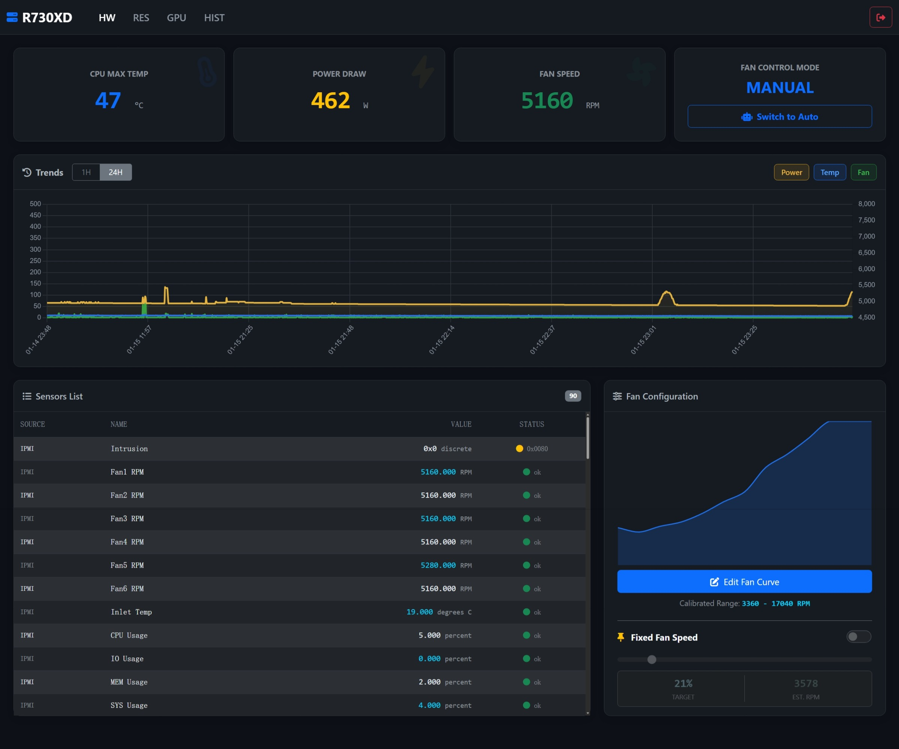
  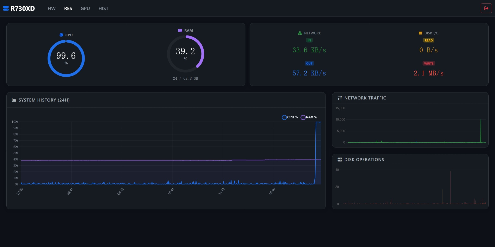
</p>

<p align="center">
  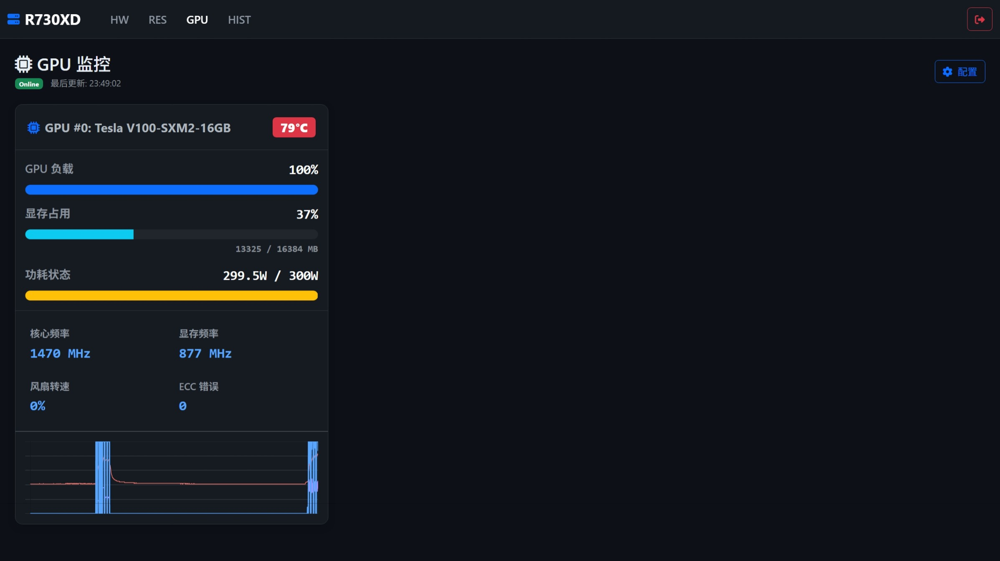
  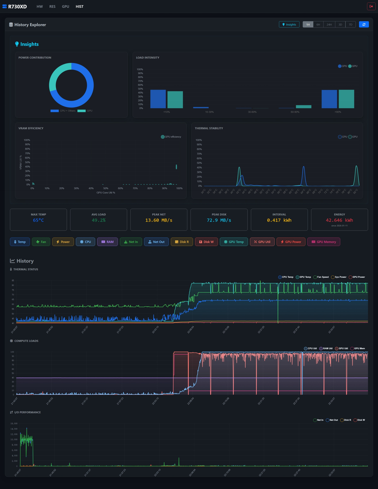
</p>

<p align="center">
  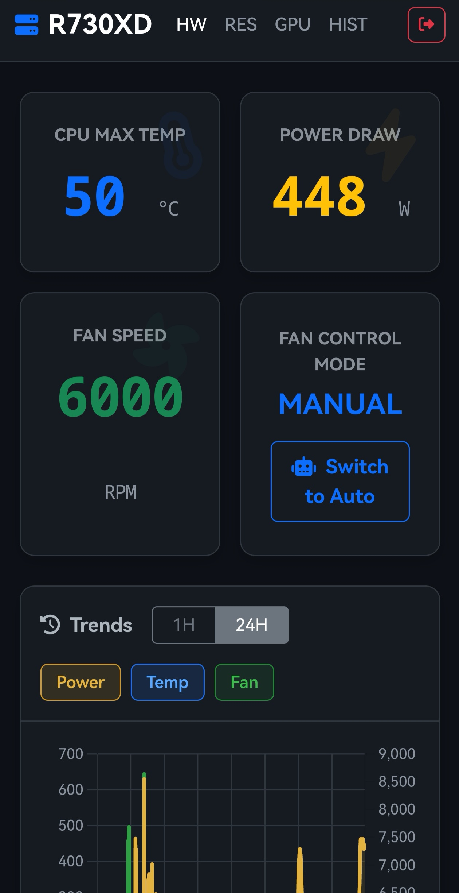
  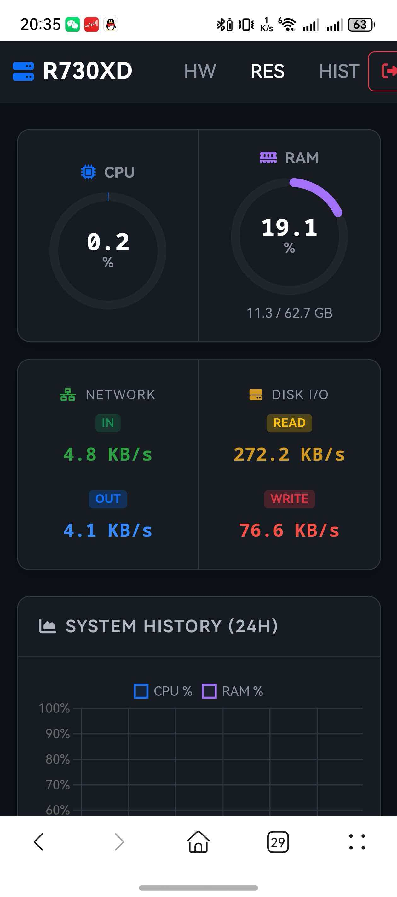
  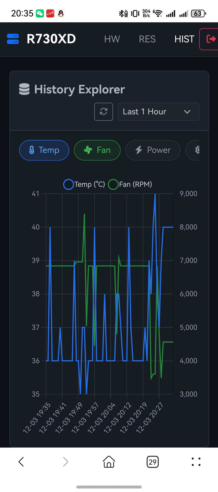
  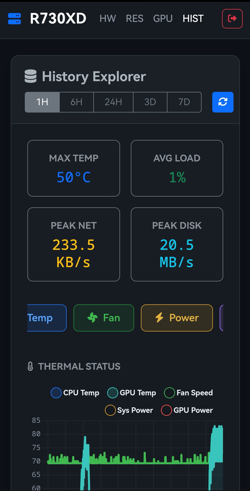
</p>

<p align="center">
  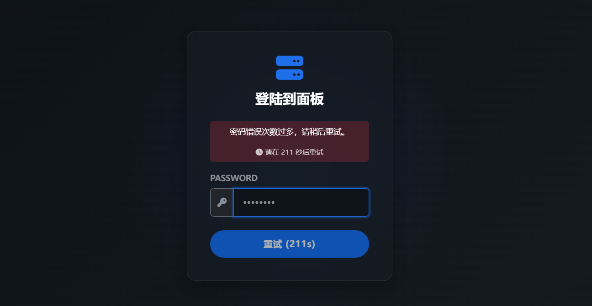
  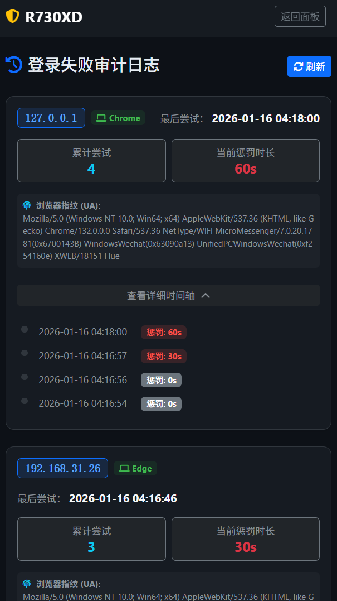
</p>

---

## Changelog

See [CHANGELOG.md](CHANGELOG.md).

## Safety Notes

Fan control and IPMI raw commands can affect hardware cooling. Test carefully on your own hardware and keep a fallback path to BMC/iDRAC/iLO or physical access.

风扇控制和 IPMI raw 命令会影响硬件散热。请先在自己的硬件上验证温度和风扇行为，并保留 BMC/iDRAC/iLO 或物理访问作为回退方案。
