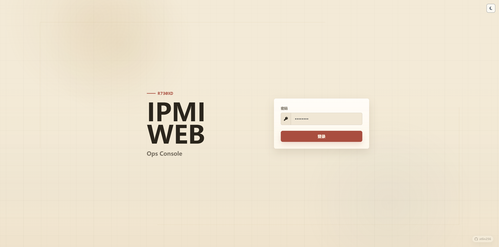
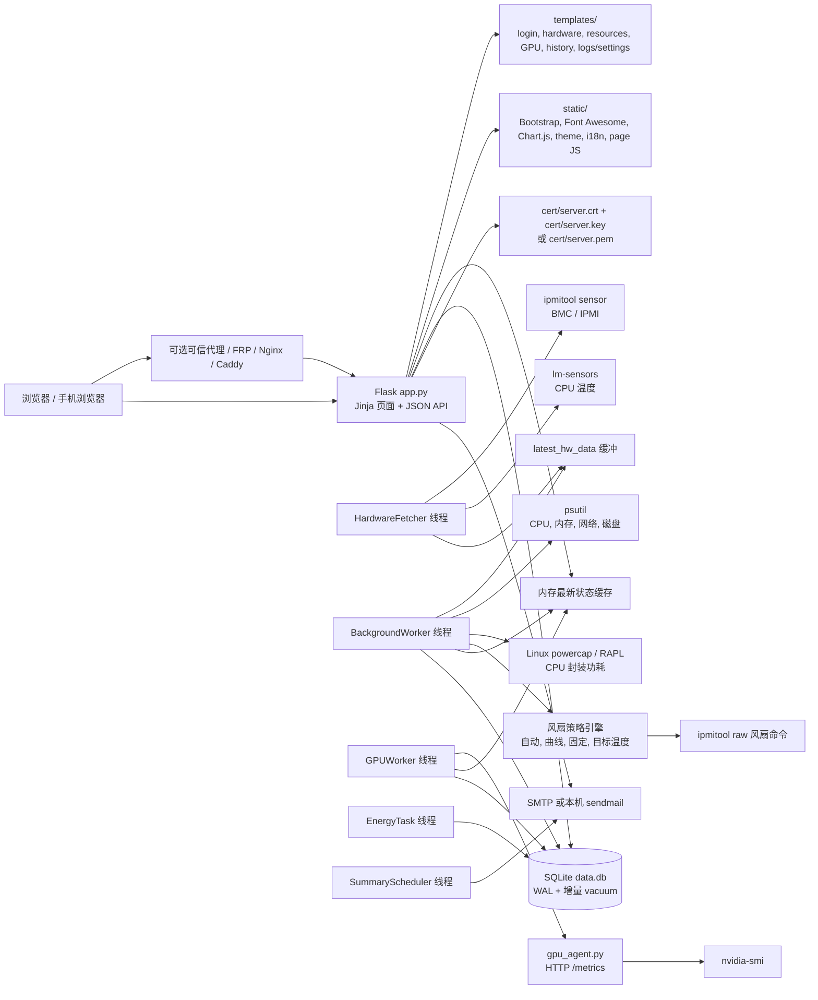
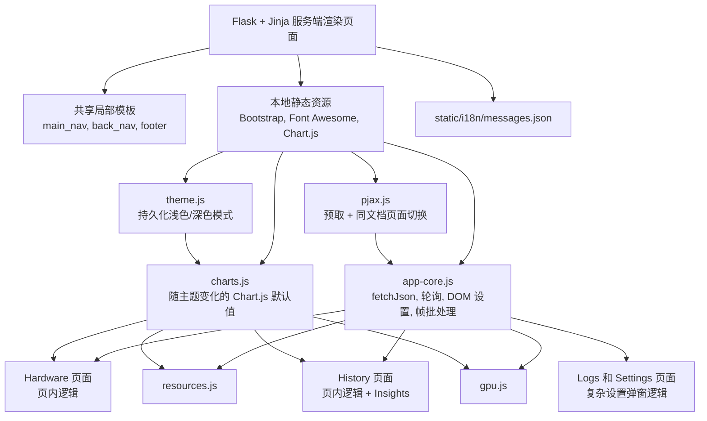
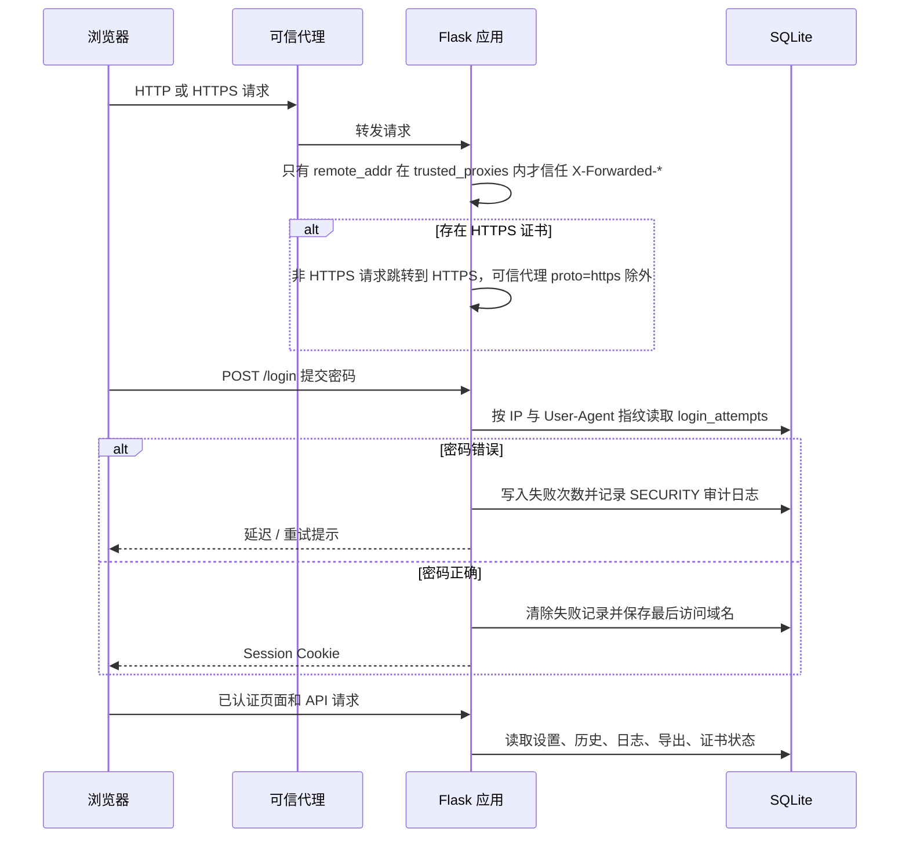
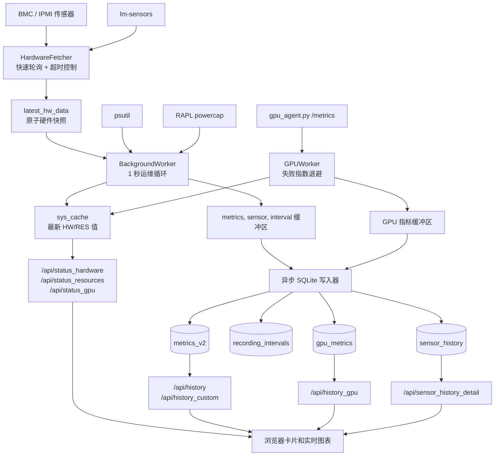
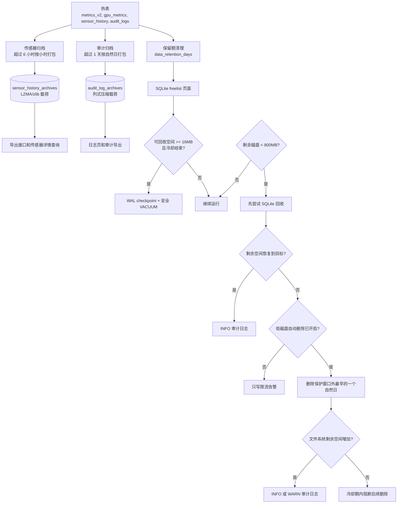

# IPMI_WEB 中文文档

[](https://deepwiki.com/stlin256/IPMI_WEB)


IPMI_WEB 是一个轻量自托管服务器运维面板，用于把 IPMI 硬件监控、风扇策略控制、系统资源图表、可选 NVIDIA GPU 监控、历史分析、审计日志、存储生命周期、证书管理、告警和邮件报告整合到一个浏览器界面中。

[English](README.md) | [快速开始](#快速开始) | [更新日志](CHANGELOG.md) | [前端重构说明](docs/frontend-modernization-plan.md)

## 当前状态

当前应用版本：`1.6.0`。

当前仓库已经进行过前端现代化重构。现在的界面风格是 **浅色优先、低饱和工业运维控制台**：信息密度较高、面板半径统一到 8px、色彩以中性系统底色为主，搭配蓝、青、绿、琥珀、红等语义强调色；导航保持紧凑粘性布局，Bootstrap、Font Awesome、Chart.js 均为本地静态资源，浅色/深色主题由 `static/js/theme.js` 持久化保存，并通过 `static/js/pjax.js` 实现带预取的同文档页面切换。项目仍保持 Flask/Jinja 服务端渲染，暂时不引入前端打包器。

前端重构目前包括：

- `static/css/app-modern.css` 提供共享设计变量、浅色优先主题和响应式约束。
- `static/js/app-core.js` 提供统一的 `fetchJson`、轮询、DOM 设置、帧批处理等页面工具。
- `static/js/charts.js` 提供随主题变化的 Chart.js 默认值。
- 带预取的 PJAX 页面切换，并在离开页面时清理定时器、事件监听、Bootstrap 实例和 Chart.js 实例。
- 默认浅色主题，同时保留用户手动选择深色模式。
- 导航和页脚已抽为局部模板。
- Resources 与 GPU 页面已经拆出独立页面脚本；Hardware、History、Logs/Settings 仍包含较多页内脚本，是后续继续迁移的重点。



## 项目背景

IPMI_WEB 最初是为作者自己的 **DELL PowerEdge R730xd** 搭建的。二手企业级服务器便宜、稳定、扩展性强，但默认 BMC 风扇策略在家庭实验室、办公室、NAS 架子或安静机柜中往往过于激进。多数时候我们并不是想替代 iDRAC、iLO、IPMI 或 BMC，而是想有一个日常好用的浏览器入口：看温度、看功耗、看风扇，必要时调整风扇策略，长期查看历史曲线，并且把登录、配置、证书、存储和告警动作留下审计记录。

这就是 IPMI_WEB 的定位。它尽量保持小而可读：Flask 负责页面和接口，SQLite 负责历史数据，Chart.js 负责趋势图，`ipmitool` 和 BMC 通信，`lm-sensors` 与 `psutil` 补充主机指标，可选的 `gpu_agent.py` 则在能运行 `nvidia-smi` 的主机或虚拟机中暴露 GPU 遥测。

## 功能总览

| 区域 | 主要能力 | 解决的问题 |
| --- | --- | --- |
| 硬件首页 | CPU 温度、IPMI 功耗、风扇 RPM、传感器列表、风扇模式 | 服务器当前是否健康 |
| 风扇控制 | BMC 自动、手动曲线、固定转速、目标温度、校准 | 在散热和噪声之间找平衡 |
| 资源页 | CPU、内存、网络、磁盘 I/O、CPU 封装功耗 | 当前负载来自哪里 |
| 历史页 | 自定义时间范围、后端聚合、能耗统计、Insights | 看长期趋势，不把秒级原始数据全塞给浏览器 |
| GPU 页 | 可选远端 GPU Agent、多 GPU 卡片、频率、功耗、显存、ECC、趋势 | 排查降频、功耗墙、散热限制和利用率问题 |
| 审计日志 | 登录、设置、证书、风扇、GPU、存储、告警、系统事件 | 追踪谁在什么时候做了什么 |
| 设置中心 | 服务器名、语言、图表、保留期、告警、邮件、报告、证书 | 管理长期运行参数 |
| 存储生命周期 | 热表、压缩归档、保留期清理、安全 SQLite 回收、低磁盘保护 | 控制 `data.db` 体积和磁盘风险 |
| 安全基础 | 登录延迟、防爆破状态、可信代理、HTTPS Cookie、敏感字段脱敏 | 更适合放到反向代理后访问 |
| i18n | 首次跟随浏览器语言，之后可固定中文或英文 | 页面、日志、邮件和更新说明保持同一语言 |

## 项目架构

### 运行时拓扑



### 前端结构



### 请求与安全边界



### 采集与图表数据流



### 存储生命周期



## 核心页面

| 路由 | 页面 | 说明 |
| --- | --- | --- |
| `/setup` | 首次配置向导 | 安装脚本开启的首次配置模式 |
| `/login` | 登录页 | 密码登录、递增延迟、防爆破、审计日志 |
| `/hardware` | 硬件首页 | 默认登录后入口 |
| `/resources` | 资源页 | CPU、内存、网络、磁盘、CPU 封装功耗 |
| `/gpu` | GPU 页 | 需要启用可选 GPU Agent |
| `/history` | 历史页 | 自定义范围、能耗、Insights、指标开关 |
| `/logs` | 日志与设置 | 类终端审计日志、设置弹窗、配置导入导出 |

重要 API 族：

- `/api/status_*` 返回内存中的最新状态。
- `/api/history`、`/api/history_custom`、`/api/history_gpu`、`/api/sensor_history_detail` 返回经过降采样或后端聚合的图表数据。
- `/api/settings`、`/api/config`、`/api/config/gpu`、`/api/alert_rules` 管理运行时设置。
- `/api/setup/certificate` 在首次配置完成前校验 HTTPS 证书/私钥。
- `/api/setup/complete` 保存首次配置，并创建首次登录会话。
- `/api/storage_status`、`/api/export_data`、`/api/config/export`、`/api/config/import` 用于维护和迁移。
- `/api/certificate` 校验证书并保存 HTTPS 文件。
- `/api/update_notice` 与 `/api/release_notes` 从 `CHANGELOG.md` 暴露版本更新说明。

## 数据模型

| 表 | 用途 |
| --- | --- |
| `config` | 运行时设置、软件版本、界面语言、保留期、邮件、报告、GPU Agent、风扇模式 |
| `metrics_v2` | 硬件和资源采样：CPU 温度、风扇 RPM、系统功耗、CPU 功耗、CPU/内存/网络/磁盘 |
| `gpu_metrics` | 每张 GPU 的温度、利用率、显存、功耗、频率、风扇、ECC |
| `sensor_history` | 近期全量传感器快照，压缩 blob 存储 |
| `sensor_history_archives` | 较旧传感器快照，按小时压缩归档 |
| `energy_hourly` | 每小时能耗积分缓存，单位 Wh |
| `audit_logs` | 近期审计事件 |
| `audit_log_archives` | 较旧审计事件，按自然日压缩归档 |
| `login_attempts` | 按客户端指纹记录防爆破状态 |
| `recording_intervals` | 采集循环间隔历史 |
| `alert_rules` 与 `alert_status` | 告警规则和触发/恢复状态 |

SQLite 使用 WAL 模式，并启用增量 vacuum 支持。长期部署仍应监控磁盘容量，因为采样时间越长、启用遥测越多，历史数据自然会增长。

## 快速开始

### 交互式安装

正式部署建议 clone 后直接运行安装脚本。每一步提示里的方括号内容就是默认值，直接回车会采用该默认值。

```bash
git clone https://github.com/stlin256/IPMI_WEB.git
cd IPMI_WEB
sudo bash scripts/install-linux.sh
```

Linux 安装脚本会完成：

- 检查当前是否为 root，避免在不能执行 `sudo` 的环境里跑到一半才失败；
- 询问是否自动安装依赖；输入 `n` 会跳过系统包安装和 Python requirements 安装；
- 在启用依赖安装时安装 Python、`ipmitool`、`lm-sensors`、Git、rsync 和 Python 依赖；
- 交互式询问 HTTP 端口、安装目录、数据目录、systemd 服务名和运行用户；运行用户默认采用启动安装脚本的账号；
- 写入 `config.json` 和 `install.json`，其中包含首次配置模式标记；
- 创建并启动 systemd 服务；
- 输出类似 `http://server-ip:90/setup` 的首次配置地址。

浏览器打开这个 setup 地址后，引导界面会配置显示用服务器名称、管理员密码、数据库保留期、低磁盘空间保护、可选 HTTPS 证书、可选 GPU Agent、可选 SMTP 邮件告警、自动更新模式和更新通道。默认通道是 `release`，只有需要紧跟 `main` 分支 commit 时才切到 `dev`。如果配置了证书，系统会校验证书/私钥匹配关系，完成后重启并跳转到 HTTPS 的硬件页面；没有配置证书时会自动登录并以 HTTP 进入 `/hardware`。

Windows 下请使用管理员 PowerShell：

```powershell
git clone https://github.com/stlin256/IPMI_WEB.git
cd IPMI_WEB
.\scripts\install-windows.ps1
```

Windows 安装脚本会使用提权计划任务作为启动管理器，因为当前 Python 应用还没有打包成原生 Windows Service。它同样会询问是否自动安装依赖，生成 `config.json` 和 `install.json`，并进入同一套首次配置向导。

### Release 发布包

`.github/workflows/release.yml` 是给 `release` 更新通道使用的手动 GitHub Actions workflow。进入 Actions 页运行 **Release Package**，填写例如 `1.6.1` 的版本号，并选择要打包的目标 ref。workflow 会校验应用、生成 `ipmi-web-<version>.zip`、`.sha256` 校验文件和 release manifest，然后把三者发布到 `v<version>` 标签对应的 GitHub Release。

### 手动开发运行

```bash
sudo apt-get update
sudo apt-get install -y ipmitool lm-sensors

python -m venv .venv
source .venv/bin/activate
pip install -r requirements.txt

cp config.json.example config.json
python app.py
```

浏览器打开：

```text
http://your-server-ip:90
```

最小 `config.json`：

```json
{
  "DATABASE": {
    "path": "/opt/IPMI_WEB/data.db",
    "retention_days": 7
  },
  "SERVER": {
    "port": 90,
    "server_name": "R730XD"
  },
  "SECURITY": {
    "login_password": "change_this_password",
    "trusted_proxies": []
  }
}
```

首次启动后，大部分运行时设置会写入 SQLite。`config.json` 主要负责启动引导：数据库路径、端口、服务器名兜底值、登录密码和可信代理网段。

## HTTPS

可以放置拆分证书文件：

```text
cert/server.crt
cert/server.key
```

也可以放置合并 PEM：

```text
cert/server.pem
```

检测到证书后，应用会启用安全 Cookie，并把普通 HTTP 跳转到 HTTPS；如果请求来自可信代理且 `X-Forwarded-Proto` 为 `https`，则不会误跳转。

首次配置向导和设置页都支持上传证书和私钥。后端会在保存前校验 PEM 格式、有效期和证书/私钥匹配关系。首次配置时如果证书有效，完成后服务会重启，浏览器会继续跳转到 HTTPS 地址。

## 可信代理

如果通过 FRP、Nginx、Caddy 或其他反向代理访问，请精确配置 `trusted_proxies`。系统只会在直接来源属于可信代理网段时信任 `X-Forwarded-For` 和 `X-Forwarded-Proto`。

```json
{
  "SECURITY": {
    "login_password": "change_this_password",
    "trusted_proxies": ["127.0.0.1/32", "10.0.0.0/8"]
  }
}
```

不要在公网直连服务时盲目信任转发头。除非可信代理会清洗并重写这些头，否则客户端可以伪造它们。

## 可选 GPU Agent

在能访问 `nvidia-smi` 的机器上运行：

```bash
python gpu_agent.py
```

默认接口：

```text
http://agent-host:9999/metrics
```

然后在 GPU 页面设置中启用。主应用会轮询 Agent、记录 GPU 历史、写入上线/离线审计事件，并在 Agent 不可用时把重试间隔逐步退避到最多 30 秒。

## 告警和邮件

设置页支持阈值告警规则，可以配置级别、持续时间和通知间隔。邮件发送支持两种模式：

- SMTP，支持 SSL/TLS 或 STARTTLS 回退。
- Linux 本机 `sendmail` MTA 模式。

概览报告可以按日报、周报或自定义间隔发送。报告会包含硬件/资源统计，并可带有服务端生成的图表图片。

## 存储说明

- 默认热数据保留期为 7 天。
- 缩短保留期会延迟 3 天生效，避免误操作立即删除历史。
- 全量传感器历史近 6 小时保留热表，较旧数据按小时压缩归档。
- 审计日志超过 1 天后按自然日压缩归档。
- 新归档载荷优先使用带前缀的 LZMA，同时保留 zlib 兼容读取。
- SQLite 可回收空间达到 16MB 且冷却结束后自动整理。
- 低磁盘自动删除默认关闭。开启后也只会在剩余空间低于 800MB 时动作，至少保护最近 7 天和当前保留期窗口，并且单次最多删除最早的 1 个自然日。
- 如果 SQLite 无法安全整理，或删除后文件系统剩余空间没有明显增加，系统会在冷却期内阻断后续自动删除，并写入审计日志。

## 安全提示

风扇控制会使用 IPMI raw 命令，可能直接影响硬件散热。请先在自己的硬件上验证温度和风扇行为，并保留 BMC/iDRAC/iLO 或物理访问作为回退路径，不要把此面板作为唯一散热保护机制。

这个项目有意保持小而可读，但它仍然是一个有权限的运维入口。请使用强登录密码，尽量部署在可信网络或反向代理后，远程访问时启用 HTTPS，并确保宿主机系统本身安全。
